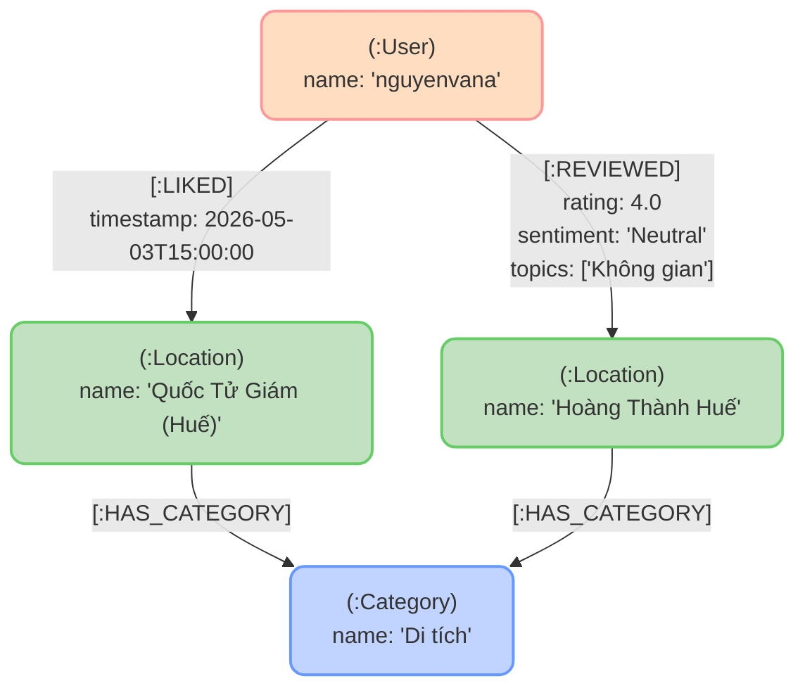
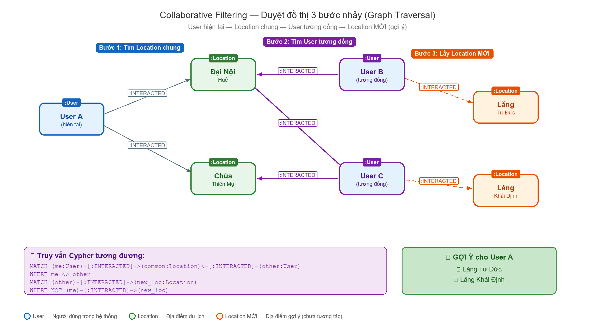

# CHƯƠNG 1: CƠ SỞ LÝ THUYẾT

Chương này trình bày các cơ sở lý thuyết liên quan đến đề tài, bao gồm: tổng quan tình hình nghiên cứu trong và ngoài nước về hệ thống gợi ý du lịch; lý thuyết về Hệ thống Gợi ý (Recommendation System) và các phương pháp chính; cơ sở dữ liệu đồ thị (Graph Database) với hệ quản trị Neo4j; các thuật toán trọng tâm của đề tài gồm PageRank, Collaborative Filtering, Content-Based Filtering và Nearest Neighbor; cùng các công nghệ nền tảng được sử dụng để xây dựng hệ thống.

## 1.1. Tổng quan Tình hình Nghiên cứu

### 1.1.1. Tình hình nghiên cứu ngoài nước

Hệ thống gợi ý (Recommendation System) đã được nghiên cứu rộng rãi từ giữa những năm 1990. Nghiên cứu tiên phong của Goldberg và cộng sự (1992) [33] về hệ thống Tapestry đã đặt nền móng cho lĩnh vực lọc cộng tác (Collaborative Filtering). Từ đó, nhiều công trình quan trọng đã được công bố:

- **Ricci và cộng sự (2015)** [7] đã hệ thống hóa toàn diện các phương pháp xây dựng hệ thống gợi ý trong cuốn _Recommender Systems Handbook_, bao gồm: lọc cộng tác, lọc theo nội dung, phương pháp lai và các kỹ thuật đánh giá hiệu quả.

- **Koren, Bell và Volinsky (2009)** [8] đề xuất kỹ thuật phân rã ma trận (Matrix Factorization) trong cuộc thi Netflix Prize, chứng minh hiệu quả vượt trội so với các phương pháp lọc cộng tác truyền thống.

- **Burke (2002)** [11] nghiên cứu chi tiết về hệ thống gợi ý lai (Hybrid Recommender Systems), phân loại 7 chiến lược kết hợp khác nhau và đánh giá hiệu quả trên các bộ dữ liệu thực tế.

- **Page và Brin (1998)** [27] công bố thuật toán PageRank — nền tảng của công cụ tìm kiếm Google — cho phép đánh giá mức độ quan trọng của các node trong đồ thị dựa trên cấu trúc liên kết.

Trong lĩnh vực cơ sở dữ liệu đồ thị, **Robinson, Webber và Eifrem (2015)** [6] đã trình bày lý thuyết và ứng dụng thực tế của Graph Database, đặc biệt là Neo4j, trong việc mô hình hóa và truy vấn dữ liệu có quan hệ phức tạp. **Angles và Gutierrez (2008)** [13] đã công bố bài survey toàn diện về các mô hình cơ sở dữ liệu đồ thị trên _ACM Computing Surveys_, phân tích và so sánh các mô hình dữ liệu đồ thị khác nhau.

Gần đây, xu hướng sử dụng Graph Database cho hệ thống gợi ý ngày càng được quan tâm:

- **Giabelli và cộng sự (2021)** [31] đề xuất hệ thống gợi ý Skills2Job mã hóa embeddings trên cơ sở dữ liệu đồ thị, chứng minh lợi thế của graph database trong việc biểu diễn và truy vấn các mối quan hệ phức tạp cho bài toán gợi ý, đăng trên _Applied Soft Computing_ (Q1).

- **Su, He, Ren và Peng (2022)** [32] xây dựng thuật toán gợi ý du lịch cá nhân hóa dựa trên đồ thị tri thức (Knowledge Graph) lưu trữ trên **Neo4j**, khai thác mối quan hệ User–Attraction để đề xuất điểm đến phù hợp, đăng trên _Applied Sciences_ (SCIE).

### 1.1.2. Tình hình nghiên cứu trong nước

Tại Việt Nam, các nghiên cứu về hệ thống gợi ý du lịch đã bắt đầu nhận được sự quan tâm trong những năm gần đây:

- **Lưu Hoài Sang, Trần Thanh Điện, Nguyễn Thanh Hải và Nguyễn Thái Nghe (2020)** [1] nghiên cứu ứng dụng kỹ thuật học sâu và các phương pháp hệ thống gợi ý (Collaborative Filtering, Matrix Factorization) trong dự báo kết quả học tập, đăng trên _Tạp chí Khoa học Trường Đại học Cần Thơ_. Nguyễn Thái Nghe và cộng sự (2020) [14] cũng nghiên cứu việc tích hợp mối quan hệ giữa các môn học vào hệ thống gợi ý sử dụng Collaborative Filtering, đăng trên _IJATCSE_.

- **Trần Cao Đệ (2017)** [3] trình bày cơ sở lý thuyết về các hệ cơ sở dữ liệu nâng cao bao gồm các mô hình NoSQL và các kỹ thuật xử lý dữ liệu hiện đại, trong giáo trình giảng dạy tại Trường Đại học Cần Thơ.

Tuy nhiên, còn rất ít nghiên cứu kết hợp đồng thời **Graph Database** với **Hybrid Recommendation** cho lĩnh vực du lịch, đặc biệt là ứng dụng cụ thể cho một thành phố di sản như Huế. Đây chính là khoảng trống mà đề tài hướng đến lấp đầy.

### 1.1.3. Nhận xét chung

Từ phân tích tổng quan trên, có thể rút ra các nhận xét:

1. **Hệ thống gợi ý** đã được nghiên cứu sâu rộng, nhưng phần lớn tập trung vào thương mại điện tử (Amazon, Netflix) và mạng xã hội. Ứng dụng chuyên biệt cho du lịch địa phương còn hạn chế.

2. **Graph Database** có lợi thế tự nhiên trong việc mô hình hóa quan hệ người dùng — địa điểm — danh mục. Một số nghiên cứu quốc tế đã bắt đầu ứng dụng graph database cho hệ thống gợi ý [31] và đặc biệt trong du lịch với Neo4j [32], nhưng ở Việt Nam hướng tiếp cận này vẫn chưa được khai thác.

3. **Phương pháp lai (Hybrid)** được đánh giá hiệu quả hơn từng phương pháp đơn lẻ [11], [12], đặc biệt trong việc giải quyết vấn đề khởi động lạnh (Cold Start).

Trên cơ sở đó, đề tài lựa chọn hướng tiếp cận **kết hợp Graph Database (Neo4j) với Hybrid Recommendation (PageRank + Collaborative Filtering + Content-Based Filtering)** để xây dựng hệ thống gợi ý du lịch thông minh cho thành phố Huế.

## 1.2. Hệ thống Gợi ý (Recommendation System)

### 1.2.1. Định nghĩa và Vai trò

**Hệ thống gợi ý (Recommendation System)** là một lớp con của hệ thống lọc thông tin, được thiết kế để dự đoán sở thích hoặc đánh giá của người dùng đối với các mục (items) và đưa ra những gợi ý phù hợp nhất [7]. Theo Adomavicius và Tuzhilin (2005) [12], hệ thống gợi ý giúp giải quyết bài toán **quá tải thông tin** (Information Overload) bằng cách lọc và cá nhân hóa nội dung cho từng người dùng.

Hệ thống gợi ý được ứng dụng rộng rãi trong nhiều lĩnh vực:

- **Thương mại điện tử:** Amazon, Shopee gợi ý sản phẩm dựa trên lịch sử mua hàng.
- **Giải trí:** Netflix, Spotify gợi ý phim, nhạc phù hợp sở thích người xem.
- **Mạng xã hội:** Facebook, TikTok gợi ý bài viết, video theo hành vi tương tác.
- **Du lịch:** TripAdvisor, Booking.com gợi ý địa điểm, khách sạn cho du khách.

### 1.2.2. Phân loại Hệ thống Gợi ý

Theo Ricci và cộng sự (2015) [7], có 3 phương pháp chính trong xây dựng hệ thống gợi ý:

#### a) Lọc theo Nội dung (Content-Based Filtering)

**Nguyên lý:** Gợi ý các items có nội dung hoặc đặc điểm tương tự với những items mà người dùng đã thể hiện sự quan tâm trước đó [10], [30].

*Ví dụ:* Nếu du khách thích "Chùa Thiên Mụ" (danh mục: Tâm linh), hệ thống sẽ gợi ý các địa điểm khác cũng thuộc danh mục "Tâm linh" như Chùa Từ Đàm, Điện Hòn Chén.

**Ưu điểm:**

- Không cần dữ liệu từ người dùng khác, hoạt động độc lập.
- Có thể giải thích lý do gợi ý cho người dùng (Explainability).
- Không gặp vấn đề Cold Start đối với item mới (nếu có đặc trưng).

**Nhược điểm:**

- Giới hạn trong phạm vi nội dung đã biết, dẫn đến hiện tượng **bẫy bong bóng lọc** (Filter Bubble).
- Khó khám phá items mới lạ ngoài sở thích hiện tại của người dùng.
- Yêu cầu đặc trưng nội dung chất lượng cao.

#### b) Lọc Cộng tác (Collaborative Filtering)

**Nguyên lý:** Gợi ý dựa trên sự tương đồng giữa các người dùng hoặc giữa các items [9], [29]. Nếu User A và User B có sở thích giống nhau, những items mà B đã thích nhưng A chưa biết sẽ được gợi ý cho A.

**Có 2 loại chính:**

- **Lọc cộng tác dựa trên người dùng (User-Based CF):** Tìm nhóm người dùng có sở thích tương tự, gợi ý từ hành vi của nhóm này [9].
- **Lọc cộng tác dựa trên Item (Item-Based CF):** Tìm các items được đánh giá tương tự bởi cùng nhóm người dùng, gợi ý items có hành vi tương đồng [29].

**Ưu điểm:**

- Không cần phân tích nội dung hay đặc trưng của item.
- Có thể phát hiện và gợi ý items mới lạ (Serendipity) ngoài sở thích trực tiếp.

**Nhược điểm:**

- **Cold Start:** Khó gợi ý cho người dùng mới (chưa có lịch sử tương tác) hoặc item mới (chưa có ai tương tác).
- **Sparsity:** Cần lượng dữ liệu tương tác đủ lớn để đạt độ chính xác cao.

#### c) Phương pháp Lai (Hybrid Approach)

**Nguyên lý:** Kết hợp Content-Based và Collaborative Filtering nhằm tận dụng ưu điểm và khắc phục nhược điểm của từng phương pháp [11].

Theo Burke (2002) [11], có nhiều chiến lược kết hợp:

| Chiến lược | Mô tả | Ví dụ |
|---|---|---|
| **Weighted** | Kết hợp điểm số các phương pháp với trọng số | Kết hợp điểm CF và CB theo tỉ lệ 3:1 |
| **Switching** | Chuyển đổi giữa các phương pháp tùy ngữ cảnh | Dùng CB khi user mới, CF khi đủ dữ liệu |
| **Mixed** | Hiển thị kết quả từ cả hai phương pháp song song | Hiển thị gợi ý CB và CF trên cùng trang |
| **Feature Combination** | Kết hợp đặc trưng từ nhiều nguồn làm đầu vào | Dùng profile user + lịch sử làm feature |

Đề tài sử dụng chiến lược **Weighted Hybrid**, kết hợp 3 thành phần: Collaborative Filtering, Content-Based Filtering và PageRank, với trọng số thích ứng (Adaptive Weighting) tùy thuộc vào lượng dữ liệu hiện có.

### 1.2.3. Vấn đề Bẫy Bong bóng Lọc (Filter Bubble)

**Định nghĩa:** Filter Bubble là hiện tượng khi hệ thống gợi ý chỉ đề xuất nội dung cùng loại với những gì người dùng đã tương tác, dẫn đến việc "giam" người dùng trong một vòng tròn nội dung hẹp [12].

*Ví dụ trong du lịch:* Nếu du khách chỉ thích "Chợ" (danh mục Mua sắm), Content-Based Filtering chỉ gợi ý các chợ khác → du khách không bao giờ khám phá được di tích lịch sử, chùa chiền hay danh lam thiên nhiên.

**Giải pháp — Diversity Pool:** Bổ sung một nhóm ứng viên đa dạng (Diversity Pool) — gồm các địa điểm phổ biến nhất không phân biệt danh mục — vào tập ứng viên gợi ý. Các ứng viên này được xếp hạng bởi thuật toán PageRank và xuất hiện ở cuối danh sách gợi ý (sau các gợi ý cá nhân hóa), đảm bảo cân bằng giữa tính cá nhân hóa và tính đa dạng.

## 1.3. Cơ sở dữ liệu Đồ thị (Graph Database)

### 1.3.1. Định nghĩa và Mô hình dữ liệu

**Cơ sở dữ liệu đồ thị (Graph Database)** là loại cơ sở dữ liệu sử dụng cấu trúc đồ thị gồm các đỉnh (nodes), cạnh (edges) và thuộc tính (properties) để lưu trữ, ánh xạ và truy vấn dữ liệu [6]. Trong mô hình này:

- **Nodes (Đỉnh):** Đại diện cho các thực thể trong hệ thống. *Ví dụ:* User, Location, Category.
- **Edges (Cạnh/Quan hệ):** Đại diện cho mối quan hệ giữa các thực thể. *Ví dụ:* :LIKED, :REVIEWED, :HAS_CATEGORY.
- **Properties (Thuộc tính):** Các cặp key-value gắn liền với nodes hoặc edges. *Ví dụ:* name, rating, weight.

Ví dụ mô hình đồ thị trong du lịch (trích xuất từ dữ liệu thực tế trong Neo4j):




### 1.3.2. So sánh với Cơ sở dữ liệu Quan hệ (RDBMS)

Bảng 1.1 trình bày so sánh chi tiết giữa cơ sở dữ liệu đồ thị và cơ sở dữ liệu quan hệ truyền thống:

*Bảng 1.1. So sánh Graph Database và RDBMS*

| Tiêu chí | RDBMS (MySQL, PostgreSQL) | Graph DB (Neo4j) |
|---|---|---|
| Mô hình dữ liệu | Bảng (Tables), hàng, cột | Đồ thị (Nodes, Edges, Properties) |
| Biểu diễn quan hệ | Foreign Keys, phép JOIN | Edges — liên kết trực tiếp |
| Truy vấn quan hệ phức tạp | Nhiều phép JOIN lồng nhau, hiệu suất giảm nhanh | Duyệt đồ thị tự nhiên (Graph Traversal), hiệu suất ổn định |
| Truy vấn nhiều bước nhảy | Rất chậm (JOIN tăng theo cấp số nhân) | Nhanh — O(k) với k là số bước nhảy |
| Schema | Cứng nhắc, cần migration | Linh hoạt, schema-free |
| Trường hợp sử dụng | Dữ liệu có cấu trúc bảng rõ ràng | Dữ liệu có quan hệ phức tạp, đa chiều |

### 1.3.3. Lý do sử dụng Graph Database trong đề tài

Graph Database phù hợp với bài toán gợi ý du lịch vì:

1. **Mối quan hệ là trọng tâm:** Hệ thống cần quản lý quan hệ đa chiều giữa người dùng, địa điểm, danh mục, đánh giá và lộ trình [6], [13].
2. **Truy vấn nhiều bước nhảy (Multi-hop Queries):** Thuật toán Collaborative Filtering yêu cầu duyệt qua quan hệ: User → Location → User khác → Location mới (3 bước nhảy).
3. **Cấu trúc mạng lưới:** Dữ liệu du lịch tự nhiên có dạng mạng lưới — nhiều người dùng tương tác với nhiều địa điểm, tạo thành đồ thị dày đặc. Nhiều nghiên cứu gần đây đã chứng minh tính hiệu quả của graph database trong xây dựng hệ thống gợi ý [31] và đặc biệt trong lĩnh vực du lịch [32].
4. **Tích hợp thuật toán đồ thị:** Các hệ quản trị Graph Database như Neo4j cung cấp sẵn thư viện thuật toán (Graph Data Science) hỗ trợ PageRank, Node Similarity mà không cần triển khai từ đầu [16].

## 1.4. Neo4j và Ngôn ngữ Truy vấn Cypher

### 1.4.1. Giới thiệu Neo4j

**Neo4j** là hệ quản trị cơ sở dữ liệu đồ thị phổ biến nhất thế giới (theo DB-Engines Ranking), được phát triển bởi Neo4j Inc. và viết bằng Java [15]. Neo4j lưu trữ dữ liệu dưới dạng nodes và relationships theo mô hình **Labeled Property Graph**, cho phép truy vấn quan hệ với tốc độ cao.

**Các đặc điểm chính của Neo4j:**

- **Native Graph Storage:** Lưu trữ đồ thị ở dạng gốc trên đĩa, không cần chuyển đổi sang bảng hay document, đảm bảo hiệu suất truy vấn tối ưu.
- **Index-Free Adjacency:** Mỗi node lưu trữ con trỏ trực tiếp đến các node lân cận, giúp duyệt đồ thị có độ phức tạp O(1) cho mỗi bước nhảy, không phụ thuộc vào kích thước tổng thể của đồ thị.
- **ACID Transactions:** Hỗ trợ giao dịch tuân thủ đầy đủ tính chất ACID (Atomicity, Consistency, Isolation, Durability), đảm bảo tính toàn vẹn dữ liệu.
- **Cypher Query Language:** Ngôn ngữ truy vấn khai báo (Declarative) được thiết kế riêng cho đồ thị, trực quan và dễ đọc.

### 1.4.2. Ngôn ngữ truy vấn Cypher

**Cypher** là ngôn ngữ truy vấn khai báo của Neo4j, lấy cảm hứng từ SQL nhưng được tối ưu cho mô hình đồ thị [15]. Cypher sử dụng cú pháp trực quan mô phỏng hình dạng các node và relationship trong đồ thị:

- **Node** được biểu diễn bằng dấu ngoặc tròn: `(n:Label {property: value})`
- **Relationship** được biểu diễn bằng dấu mũi tên: `-[:TYPE {property: value}]->`

*Bảng 1.2. Các mệnh đề Cypher thường dùng*

| Mệnh đề | Chức năng | Tương đương SQL |
|---|---|---|
| `MATCH` | Tìm kiếm pattern trong đồ thị | `SELECT ... FROM ... JOIN` |
| `WHERE` | Lọc kết quả theo điều kiện | `WHERE` |
| `CREATE` | Tạo node hoặc relationship mới | `INSERT INTO` |
| `MERGE` | Tạo nếu chưa tồn tại, cập nhật nếu có | `INSERT ... ON DUPLICATE KEY UPDATE` |
| `RETURN` | Trả về kết quả | `SELECT` (kết quả cuối) |
| `ORDER BY` | Sắp xếp kết quả | `ORDER BY` |
| `DELETE` | Xóa node hoặc relationship | `DELETE` |
| `SET` | Cập nhật thuộc tính | `UPDATE ... SET` |

### 1.4.3. Neo4j Graph Data Science (GDS)

**Neo4j GDS** là thư viện mở rộng cung cấp hơn 60 thuật toán phân tích đồ thị và Machine Learning, được thiết kế để chạy hiệu quả trên dữ liệu lớn trong Neo4j [16].

*Bảng 1.3. Các nhóm thuật toán trong Neo4j GDS*

| Nhóm thuật toán | Thuật toán tiêu biểu | Ứng dụng trong đề tài |
|---|---|---|
| **Centrality** (Đo độ trung tâm) | PageRank, Betweenness, Closeness | Đánh giá độ phổ biến địa điểm |
| **Similarity** (Đo độ tương đồng) | Node Similarity (Jaccard), Cosine | Tìm user/location tương đồng |
| **Community Detection** (Phát hiện nhóm) | Louvain, Label Propagation | Phân nhóm địa điểm (tiềm năng) |
| **Path Finding** (Tìm đường) | Dijkstra, A* | Tối ưu lộ trình (tiềm năng) |

Trong đề tài, hai thuật toán được sử dụng chính là **PageRank** (nhóm Centrality) và **Node Similarity** (nhóm Similarity).

## 1.5. Thuật toán PageRank

### 1.5.1. Lịch sử và Nguyên lý

**PageRank** là thuật toán được phát triển bởi Larry Page và Sergey Brin tại Đại học Stanford năm 1996, là nền tảng toán học của công cụ tìm kiếm Google [4], [27].

**Nguyên lý cốt lõi:** *"Một trang web (node) được coi là quan trọng nếu có nhiều trang web quan trọng khác liên kết đến nó."* Nói cách khác, PageRank đánh giá tầm quan trọng của mỗi node dựa trên **số lượng** và **chất lượng** các liên kết đến node đó.

**Áp dụng vào bài toán du lịch:** *"Một địa điểm du lịch được coi là phổ biến nếu có nhiều người dùng (đặc biệt là những người dùng tích cực) tương tác với nó."*

### 1.5.2. Công thức Toán học

Công thức tổng quát của PageRank [4]:

$$PR(u) = \frac{1-d}{N} + d \times \sum_{v \in B_u} \frac{PR(v)}{L(v)}$$

Trong đó:

- **PR(u):** Giá trị PageRank của node u.
- **d:** Hệ số tắt dần (Damping Factor), thường được chọn bằng 0.85 — biểu diễn xác suất người dùng tiếp tục duyệt đồ thị thay vì "nhảy ngẫu nhiên" sang node bất kỳ.
- **N:** Tổng số nodes trong đồ thị.
- **B_u:** Tập hợp các nodes có cạnh hướng đến node u (in-links).
- **L(v):** Số cạnh đi ra từ node v (out-degree).

**Quá trình tính toán:** PageRank được tính lặp (iterative). Ban đầu, mọi node có giá trị bằng nhau (1/N). Qua mỗi vòng lặp, giá trị được phân phối lại dựa trên cấu trúc liên kết, cho đến khi hội tụ (sai số giữa 2 vòng liên tiếp nhỏ hơn ngưỡng tolerance).

### 1.5.3. Weighted PageRank

**Weighted PageRank** là biến thể của PageRank cho phép các cạnh (edges) có trọng số khác nhau, phản ánh mức độ quan trọng khác nhau của mỗi mối quan hệ [5].

**Ứng dụng trong đề tài:**

Thay vì coi mọi tương tác như nhau, Weighted PageRank phân biệt mức độ tương tác:

*Bảng 1.4. Trọng số tương tác trong đề tài*

| Loại tương tác | Trọng số | Giải thích |
|---|---|---|
| Like (❤️) | 1.0 | Thể hiện sự quan tâm cơ bản |
| Review 1-5 ⭐ | 1.0 – 5.0 | Trọng số bằng số sao đánh giá |
| Tổng tối đa | 6.0 | Like (1.0) + Review 5 sao (5.0) |

Như vậy, một địa điểm nhận được đánh giá 5 sao sẽ có trọng số tương tác cao gấp 5 lần so với chỉ được đánh giá 1 sao, giúp PageRank phản ánh chính xác hơn chất lượng thực sự của địa điểm.

### 1.5.4. Các tham số điều chỉnh

*Bảng 1.5. Các tham số PageRank và ý nghĩa*

| Tham số | Phạm vi | Ý nghĩa |
|---|---|---|
| **dampingFactor (d)** | 0.85 – 0.90 | Xác suất tiếp tục duyệt. Giá trị cao ưu tiên tín hiệu cục bộ (local), giá trị thấp ưu tiên toàn cục (global). |
| **maxIterations** | 10 – 20 | Số vòng lặp tối đa. Đủ lớn để đảm bảo hội tụ trên đồ thị nhỏ-vừa. |
| **tolerance** | 0.0001 | Ngưỡng hội tụ — thuật toán dừng khi sai số giữa 2 vòng lặp nhỏ hơn giá trị này. |

## 1.6. Thuật toán Lọc Cộng tác (Collaborative Filtering)

### 1.6.1. Lọc cộng tác dựa trên người dùng (User-Based Collaborative Filtering)

**Nguyên lý:** Tìm nhóm người dùng có sở thích tương tự (similar users) với người dùng hiện tại, sau đó gợi ý các items mà nhóm này đã thích nhưng người dùng hiện tại chưa biết [9].

**Quy trình thực hiện:**

```
Bước 1: Xây dựng ma trận User-Item (tương tác/đánh giá)
Bước 2: Tính độ tương đồng giữa các cặp người dùng
Bước 3: Tìm K người dùng tương đồng nhất (K-Nearest Neighbors)
Bước 4: Tổng hợp items từ nhóm tương đồng → Gợi ý
```

### 1.6.2. Độ đo Tương đồng (Similarity Metrics)

Để đo mức độ tương đồng giữa 2 người dùng, có nhiều phương pháp [7]:

**a) Cosine Similarity:**

$$sim(u, v) = \frac{\vec{u} \cdot \vec{v}}{||\vec{u}|| \times ||\vec{v}||}$$

Đo góc giữa 2 vector đánh giá. Giá trị từ -1 (hoàn toàn ngược) đến 1 (hoàn toàn giống).

**b) Jaccard Similarity (được sử dụng trong đề tài):**

$$Jaccard(A, B) = \frac{|A \cap B|}{|A \cup B|}$$

Trong đó A, B là tập hợp các items mà mỗi user đã tương tác. Giá trị từ 0 (không có gì chung) đến 1 (hoàn toàn giống nhau).

*Ví dụ:* User A thích {Đại Nội, Chùa Thiên Mụ, Lăng Khải Định}, User B thích {Đại Nội, Chùa Thiên Mụ, Lăng Tự Đức}:
- Giao: {Đại Nội, Chùa Thiên Mụ} → |A ∩ B| = 2
- Hợp: {Đại Nội, Chùa Thiên Mụ, Lăng Khải Định, Lăng Tự Đức} → |A ∪ B| = 4
- Jaccard(A, B) = 2/4 = **0.5** (50% tương đồng)

**Lý do chọn Jaccard:** Đề tài sử dụng dữ liệu tương tác dạng nhị phân (đã/chưa tương tác) trên đồ thị Neo4j, và Neo4j GDS hỗ trợ sẵn thuật toán Node Similarity dựa trên Jaccard Index [16], phù hợp với đặc điểm dữ liệu.

### 1.6.3. Lọc cộng tác dựa trên Item (Item-Based Collaborative Filtering)

**Nguyên lý:** Thay vì so sánh người dùng, phương pháp này so sánh các items. Nếu người dùng thích item A, hệ thống sẽ tìm các items tương tự với A (dựa trên tập người dùng đã tương tác với chúng) để gợi ý [29].

**Ưu điểm so với phương pháp dựa trên người dùng (User-Based):**

- Ổn định hơn vì đặc trưng item ít thay đổi theo thời gian.
- Có thể tính toán trước (offline) rồi phục vụ trực tuyến.

### 1.6.4. Triển khai trên Graph Database

Một lợi thế quan trọng của Graph Database là khả năng triển khai Collaborative Filtering dưới dạng **duyệt đồ thị (Graph Traversal)** thay vì phép nhân ma trận truyền thống [6]. Quy trình duyệt đồ thị 3 bước nhảy (3-hop traversal) được biểu diễn qua sơ đồ:

*Hình 1.1. Sơ đồ Graph Traversal — Collaborative Filtering trên Graph Database*



Quy trình 3 bước nhảy (3-hop traversal) hoạt động như sau:

- **Bước 1 — Tìm Location chung:** Xuất phát từ User hiện tại (User A), duyệt qua quan hệ `:INTERACTED` để tìm tất cả các địa điểm mà User A đã tương tác (ví dụ: Đại Nội Huế, Chùa Thiên Mụ).

- **Bước 2 — Tìm User tương đồng:** Từ các Location chung đó, duyệt ngược qua `:INTERACTED` để tìm những người dùng khác (User B, User C) cũng đã tương tác với cùng các địa điểm — đây chính là nhóm User tương đồng.

- **Bước 3 — Lấy Location MỚI:** Từ nhóm User tương đồng, tiếp tục duyệt qua `:INTERACTED` để tìm các địa điểm mà họ đã thích nhưng User A chưa biết (ví dụ: Lăng Tự Đức, Lăng Khải Định) → đưa vào danh sách gợi ý.

Với cách tiếp cận này, việc tìm kiếm gợi ý trở thành bài toán duyệt đường đi trên đồ thị (3 bước nhảy), tận dụng lợi thế tốc độ truy vấn quan hệ O(1) cho mỗi bước nhảy của Neo4j — không phụ thuộc vào kích thước tổng thể của đồ thị.

## 1.7. Thuật toán Lọc theo Nội dung (Content-Based Filtering)

### 1.7.1. Nguyên lý Hoạt động

**Content-Based Filtering (CBF)** là phương pháp gợi ý dựa trên việc phân tích nội dung và đặc điểm (features) của items, từ đó tìm các items có đặc trưng tương tự với những items mà người dùng đã thể hiện sự quan tâm trước đó [10], [30]. Khác với Collaborative Filtering (cần dữ liệu từ nhiều người dùng), CBF chỉ cần dữ liệu từ **chính người dùng hiện tại** kết hợp với **đặc trưng nội dung** của items.

**Quy trình hoạt động 3 bước:**

- **Bước 1 — Trích xuất đặc trưng (Feature Extraction):** Mỗi item được biểu diễn dưới dạng tập hợp các đặc trưng. Trong bài toán du lịch, đặc trưng chính của mỗi địa điểm là **danh mục** (Category) mà nó thuộc về — ví dụ: "Di tích lịch sử", "Ẩm thực", "Tâm linh".

- **Bước 2 — Xây dựng hồ sơ sở thích (User Profile Construction):** Hệ thống phân tích hành vi của người dùng (đã thích, đã đánh giá) để xác định các đặc trưng mà họ ưu tiên. Ví dụ: nếu người dùng đã thích 3 địa điểm thuộc danh mục "Di tích lịch sử", hồ sơ của họ sẽ có trọng số cao cho danh mục này.

- **Bước 3 — So khớp và Gợi ý (Similarity Matching):** So sánh đặc trưng của các items chưa tương tác với hồ sơ sở thích, ưu tiên những items có mức độ trùng khớp cao nhất.

**Lựa chọn đặc trưng cho đề tài:**

Trong lý thuyết chung, CBF có thể sử dụng nhiều loại đặc trưng: văn bản (TF-IDF, Word Embeddings), metadata (tags, vị trí), hoặc danh mục (nhãn phân loại) [10]. Tuy nhiên, các kỹ thuật xử lý văn bản đòi hỏi tập dữ liệu lớn và mô hình NLP phức tạp — không phù hợp với quy mô đề tài.

Đề tài sử dụng kỹ thuật **So khớp nhãn danh mục (Category Label Matching)** trên cơ sở dữ liệu đồ thị, cụ thể:

- **Đặc trưng sử dụng:** Danh mục (Category) của địa điểm — mỗi địa điểm được gắn nhãn như "Di tích lịch sử", "Ẩm thực", "Tâm linh" thông qua quan hệ `:HAS_CATEGORY` trong Neo4j.
- **Phương pháp so khớp:** Duyệt đồ thị (Graph Traversal) — từ địa điểm đã thích, duyệt qua node `:Category` chung để tìm các địa điểm có cùng danh mục. Hai địa điểm chia sẻ cùng node Category được coi là có nội dung tương tự.
- **Lý do lựa chọn:** (1) Dữ liệu du lịch có danh mục phân loại rõ ràng, sẵn có; (2) Tận dụng trực tiếp cấu trúc đồ thị của Neo4j mà không cần thư viện NLP bổ sung; (3) Kết quả trực quan, dễ giải thích cho người dùng.

### 1.7.2. Ứng dụng trong đề tài

Trong hệ thống gợi ý du lịch Huế, Content-Based Filtering dựa trên hai đặc trưng chính:

1. **Danh mục (Category):** Mỗi địa điểm thuộc một hoặc nhiều danh mục (Di tích lịch sử, Ẩm thực, Tâm linh, Thiên nhiên...). Hai địa điểm cùng danh mục được coi là có nội dung tương tự.

2. **Quan hệ đồng xuất hiện (Co-occurrence):** Nếu nhiều người dùng cùng tương tác với hai địa điểm A và B, hệ thống tạo liên kết RELATED_TO giữa A và B, phản ánh sự tương đồng ngầm dựa trên hành vi cộng đồng.

Sự kết hợp cả hai đặc trưng giúp hệ thống vừa gợi ý dựa trên nội dung (Category) vừa dựa trên hành vi tập thể (Co-occurrence), tăng độ chính xác và đa dạng.

## 1.8. Cơ sở lý thuyết cho tính năng hỗ trợ lập lộ trình

Mặc dù trọng tâm của hệ thống là khả năng cá nhân hoá và gợi ý các địa điểm chất lượng, nhằm hoàn thiện tính khả dụng của ứng dụng (usability), hệ thống có tích hợp thêm một tính năng phụ trợ là sắp xếp lộ trình cơ bản. 

Để giải quyết bài toán sắp xếp vị trí địa lý cho danh sách các điểm đã được người dùng chọn (tương tự bài toán Heuristic kinh điển Travelling Salesman Problem - TSP), hệ thống sử dụng thuật toán xấp xỉ Láng giềng gần nhất (Greedy Nearest Neighbor). Nguyên lý tham lam cục bộ — luôn ưu tiên di chuyển đến địa điểm chưa đi có khoảng cách không gian ngắn nhất so với điểm hiện tại — giúp tính toán trả về kết quả cấu trúc chuyến đi trong thời gian vô cùng ngắn, đáp ứng được tính nhanh nhẹn của một công cụ hỗ trợ trải nghiệm. Phần triển khai này chỉ được xem như tiện ích mở rộng bổ sung để tăng tính hữu dụng, chứ không phải trung tâm nghiên cứu thuật toán của hệ thống.

## 1.9. Các Công nghệ Nền tảng

### 1.9.1. Flask Framework

**Flask** là một micro web framework cho ngôn ngữ Python, được phát triển bởi Armin Ronacher (Pallets Projects) [17]. Flask được thiết kế theo triết lý "tối giản nhưng linh hoạt", chỉ cung cấp các thành phần cốt lõi (routing, templating, request/response handling) và cho phép nhà phát triển tự do lựa chọn các extension bổ sung.

**Đặc điểm chính:**

- **Lightweight:** Không có sẵn ORM, form validation hay authentication — giúp ứng dụng nhẹ và khởi động nhanh.
- **Extensible:** Dễ dàng mở rộng với hàng trăm Flask extensions (Flask-Login, Flask-CORS, Flask-RESTful...).
- **Jinja2 Template Engine:** Hỗ trợ tạo trang HTML động với cú pháp template mạnh mẽ, hỗ trợ kế thừa (template inheritance) và macro.
- **Blueprints:** Cơ chế tổ chức code theo module, phù hợp cho ứng dụng quy mô vừa-lớn.
- **WSGI Compliant:** Tuân thủ chuẩn WSGI, dễ dàng triển khai trên nhiều máy chủ (Gunicorn, uWSGI, Nginx).

*Bảng 1.6. So sánh Flask và Django*

| Tiêu chí | Flask | Django |
|---|---|---|
| Loại | Microframework | Full-stack framework |
| Mức độ tùy chỉnh | Cao — tự do lựa chọn thành phần | Trung bình — có sẵn nhiều thành phần |
| Đường cong học tập | Dễ tiếp cận | Cần thời gian làm quen |
| Built-in features | Ít (cốt lõi) | Nhiều (Admin, ORM, Auth...) |
| Phù hợp với | API, microservice, ứng dụng nhỏ-vừa | Ứng dụng web phức tạp, CMS |

**Lý do chọn Flask:** Đề tài cần xây dựng RESTful API kết nối với Neo4j (không dùng ORM truyền thống), do đó Flask với tính linh hoạt cao là lựa chọn phù hợp hơn Django.

### 1.9.2. Leaflet.js

**Leaflet** là thư viện JavaScript mã nguồn mở hàng đầu dùng để tạo bản đồ tương tác trên nền web, được phát triển bởi Volodymyr Agafonkin [18].

**Đặc điểm chính:**

- **Nhẹ:** Chỉ khoảng 42KB (gzipped), nhanh chóng tải và khởi tạo.
- **API đơn giản:** Cung cấp các hàm trực quan để thêm marker, popup, polyline, polygon lên bản đồ.
- **Mobile-Friendly:** Hỗ trợ sự kiện chạm (touch events) và cử chỉ (gestures) trên thiết bị di động.
- **Hệ sinh thái Plugin phong phú:** Hỗ trợ hàng trăm plugin bổ sung — trong đề tài sử dụng:
  - **Leaflet.heat:** Tạo bản đồ nhiệt (Heatmap) hiển thị mật độ phổ biến địa điểm.
  - **Leaflet.markercluster:** Gom nhóm markers tự động khi zoom out, tránh rối mắt.

### 1.9.3. OpenStreetMap (OSM)

**OpenStreetMap (OSM)** là dự án bản đồ mã nguồn mở lớn nhất thế giới, được xây dựng và duy trì bởi cộng đồng toàn cầu với hàng triệu người đóng góp [19].

**Vai trò trong đề tài:** OSM cung cấp **tile layer** (lớp ảnh bản đồ) miễn phí cho Leaflet.js, hiển thị nền bản đồ với đường xá, địa hình và các điểm mốc. So với Google Maps API (có giới hạn số lượt gọi và tính phí), OSM hoàn toàn miễn phí và phù hợp cho dự án nghiên cứu.

### 1.9.4. Các công nghệ bổ trợ khác

| Công nghệ | Vai trò trong đề tài |
|---|---|
| **Python 3.9+** | Ngôn ngữ lập trình chính cho backend [23] |
| **JavaScript ES6+** | Ngôn ngữ lập trình frontend, xử lý tương tác người dùng [20] |
| **HTML5 / CSS3** | Cấu trúc và giao diện ứng dụng web [21] |
| **Neo4j Python Driver** | Kết nối và thực thi truy vấn Cypher từ Python [15] |
| **Werkzeug** | Mã hóa mật khẩu an toàn (PBKDF2-SHA256) [17] |
| **Flask-Login** | Quản lý phiên đăng nhập và xác thực người dùng [17] |
| **Pandas** | Xử lý dữ liệu dạng bảng trước khi nạp vào đồ thị |
| **openpyxl** | Đọc/ghi file Excel để import/export dữ liệu địa điểm |

## 1.10. Tiểu kết chương 1

Chương này đã trình bày đầy đủ các cơ sở lý thuyết và công nghệ nền tảng phục vụ cho việc xây dựng hệ thống gợi ý du lịch thông minh. Cụ thể:

1. **Tổng quan tình hình nghiên cứu:** Phân tích các công trình trong và ngoài nước, xác định khoảng trống nghiên cứu là sự kết hợp Graph Database với Hybrid Recommendation cho du lịch địa phương tại Việt Nam.

2. **Hệ thống Gợi ý:** Trình bày 3 phương pháp chính (Content-Based, Collaborative Filtering, Hybrid) cùng ưu nhược điểm và vấn đề Filter Bubble.

3. **Graph Database và Neo4j:** Định nghĩa, so sánh với RDBMS, giới thiệu Neo4j và ngôn ngữ Cypher, cùng thư viện Neo4j GDS cho thuật toán đồ thị.

4. **Thuật toán PageRank:** Nguyên lý, công thức toán học, biến thể Weighted PageRank với trọng số tương tác và các tham số điều chỉnh.

5. **Collaborative Filtering:** Lọc cộng tác dựa trên người dùng (User-Based), Lọc cộng tác dựa trên Item (Item-Based), các độ đo tương đồng (Cosine, Jaccard) và triển khai dạng Graph Traversal trên Neo4j.

6. **Content-Based Filtering:** Lọc theo danh mục và đồng xuất hiện, ứng dụng trong bài toán du lịch.

7. **Nearest Neighbor:** Thuật toán tối ưu lộ trình cho AI Planner, phân tích độ phức tạp và lý do lựa chọn.

8. **Công nghệ nền tảng:** Flask (backend), Leaflet.js (bản đồ), OpenStreetMap (tile layer) và các thư viện hỗ trợ.

Các kiến thức lý thuyết và công nghệ trình bày trong chương này là nền tảng quan trọng để phân tích, thiết kế và triển khai hệ thống Huế Travel AI được trình bày chi tiết ở các chương tiếp theo.
