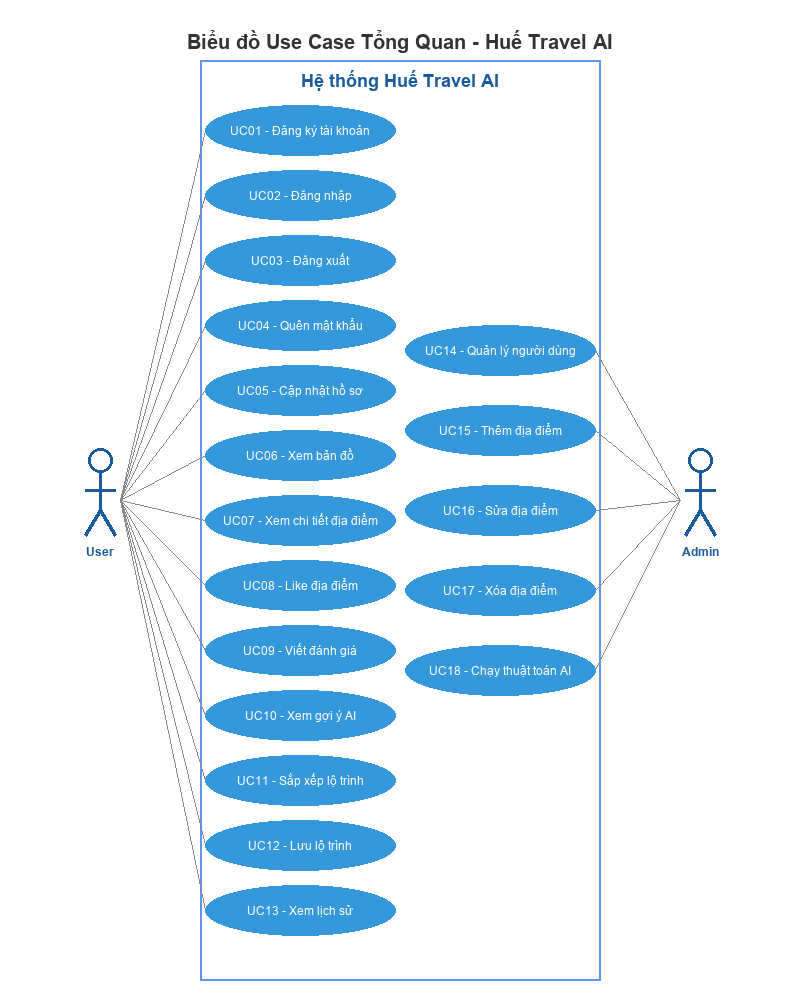
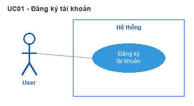
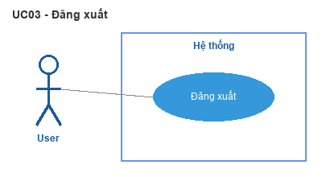
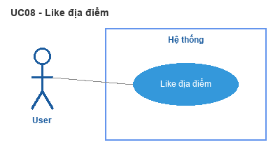
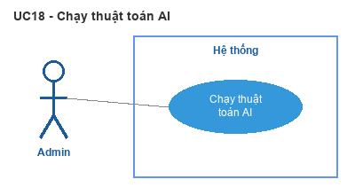
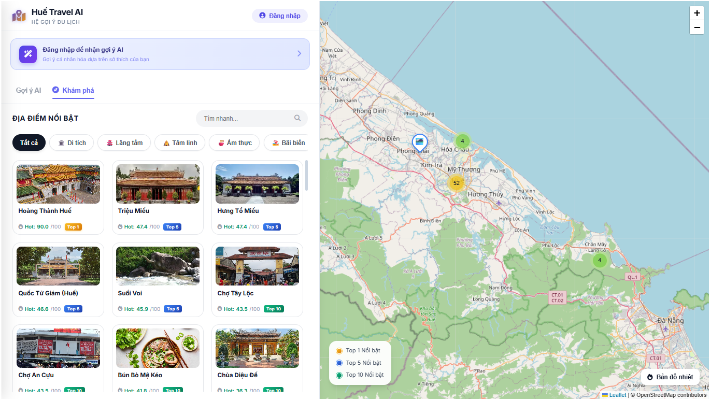
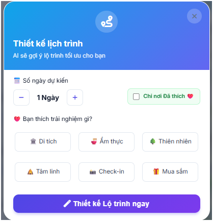

# CHƯƠNG 2: PHÂN TÍCH VÀ THIẾT KẾ HỆ THỐNG

Chương này trình bày quá trình phân tích yêu cầu và thiết kế hệ thống Huế Travel AI, bao gồm: phân tích các yêu cầu chức năng và phi chức năng; mô hình hóa hệ thống bằng biểu đồ Use Case; thiết kế kiến trúc phân lớp; thiết kế lược đồ cơ sở dữ liệu đồ thị; thiết kế RESTful API; wireframe giao diện; và flowchart các thuật toán chính.


## 2.1. Giới thiệu về phân tích và thiết kế hệ thống

Phát triển một hệ thống phần mềm là một quá trình phức tạp, đòi hỏi sự phối hợp chặt chẽ giữa nhiều giai đoạn khác nhau. Trong thực tế, hầu hết các mô hình phát triển phần mềm hiện đại đều chia quy trình thành các giai đoạn cơ bản:

(1) Khảo sát và xác định yêu cầu - thu thập và làm rõ yêu cầu từ phía người dùng và các bên liên quan;

(2) Phân tích hệ thống - làm rõ bài toán cần giải quyết, xác định hệ thống cần làm gì, ai sẽ sử dụng và các quy trình nghiệp vụ nào cần được hỗ trợ;

(3) Thiết kế hệ thống - xác định cách thức đáp ứng các yêu cầu, bao gồm thiết kế kiến trúc tổng thể, cơ sở dữ liệu, giao diện và các module chức năng;

## 2.2. Phân tích và thiết kế hệ thống Huế Travel AI

Trong đề tài này, em lựa chọn hướng tiếp cận phân tích và thiết kế hướng đối tượng (Object-Oriented Analysis and Design - OOAD) sử dụng ngôn ngữ mô hình hóa thống nhất UML (Unified Modeling Language). Đây là phương pháp phổ biến và được chuẩn hóa rộng rãi trong ngành công nghệ phần mềm, cho phép mô tả hệ thống một cách trực quan và nhất quán. Lựa chọn này đặc biệt phù hợp bởi hệ thống được xây dựng là một ứng dụng web phục vụ tương tác giữa người dùng và quản trị viên — hai tác nhân có vai trò và hành vi rõ ràng, dễ mô hình hóa bằng đối tượng.

## 2.3. Phân tích Yêu cầu Hệ thống

### 2.3.1. Yêu cầu Chức năng

Dựa trên phân tích bài toán đặt ra ở phần Mở đầu, hệ thống Huế Travel AI cần đáp ứng hai nhóm yêu cầu chức năng chính: nhóm chức năng dành cho Người dùng (User) và nhóm chức năng dành cho Quản trị viên (Admin).

**a) Nhóm chức năng Người dùng (User):**

*Bảng 2.1. Danh sách yêu cầu chức năng — Nhóm Người dùng*

| STT  | Mã UC | Chức năng             | Mô tả                                                      |
| ---- | ----- | --------------------- | ---------------------------------------------------------- |
| 1    | UC01  | Đăng ký tài khoản     | Tạo tài khoản mới với username, password và email          |
| 2    | UC02  | Đăng nhập             | Xác thực người dùng và tạo phiên làm việc (session)       |
| 3    | UC03  | Đăng xuất             | Kết thúc phiên làm việc hiện tại                           |
| 4    | UC04  | Quên mật khẩu         | Đặt lại mật khẩu qua xác minh email                       |
| 5    | UC05  | Cập nhật hồ sơ        | Sửa thông tin cá nhân (tên, email)                         |
| 6    | UC06  | Xem bản đồ            | Hiển thị bản đồ tương tác với các địa điểm du lịch        |
| 7    | UC07  | Xem chi tiết địa điểm | Xem thông tin, hình ảnh, đánh giá của từng địa điểm       |
| 8    | UC08  | Like địa điểm         | Thêm/bỏ địa điểm vào danh sách yêu thích                 |
| 9    | UC09  | Viết đánh giá         | Chấm điểm (1–5 sao) và viết bình luận cho địa điểm       |
| 10   | UC10  | Xem gợi ý AI          | Xem danh sách địa điểm được hệ thống gợi ý cá nhân hóa   |
| 11   | UC11  | Sắp xếp lộ trình      | Tiện ích tự động xếp lịch trình tham quan cơ bản theo ngày|
| 12   | UC12  | Lưu lộ trình          | Lưu lộ trình đã tạo để xem lại sau                        |
| 13   | UC13  | Xem lịch sử           | Xem danh sách địa điểm đã thích, đánh giá và lộ trình đã lưu |

**b) Nhóm chức năng Quản trị viên (Admin):**

*Bảng 2.2. Danh sách yêu cầu chức năng — Nhóm Quản trị viên*

| STT  | Mã UC | Chức năng          | Mô tả                                          |
| ---- | ----- | ------------------ | ---------------------------------------------- |
| 14   | UC14  | Quản lý người dùng | Xem danh sách, xóa tài khoản người dùng       |
| 15   | UC15  | Thêm địa điểm      | Tạo địa điểm mới với đầy đủ thông tin         |
| 16   | UC16  | Sửa địa điểm       | Cập nhật thông tin địa điểm hiện có            |
| 17   | UC17  | Xóa địa điểm       | Loại bỏ địa điểm khỏi hệ thống                |
| 18   | UC18  | Chạy thuật toán AI | Cập nhật lại điểm PageRank và các chỉ số AI   |

### 2.3.2. Yêu cầu Phi chức năng

Ngoài các yêu cầu chức năng, hệ thống cần đảm bảo các yêu cầu phi chức năng được trình bày trong Bảng 2.3.

*Bảng 2.3. Yêu cầu phi chức năng của hệ thống*

| Loại                 | Yêu cầu            | Mô tả chi tiết                                           |
| -------------------- | ------------------ | -------------------------------------------------------- |
| **Hiệu năng**        | Thời gian phản hồi | Mỗi API phản hồi trong vòng < 500ms                     |
| **Hiệu năng**        | Xử lý đồng thời   | Hỗ trợ tối thiểu 100 người dùng truy cập đồng thời     |
| **Bảo mật**          | Mã hóa mật khẩu    | Sử dụng thuật toán băm PBKDF2-SHA256 (Werkzeug)         |
| **Bảo mật**          | Quản lý phiên      | Flask-Login quản lý session, chống truy cập trái phép   |
| **Bảo mật**          | Chống injection    | Sử dụng parameterized queries cho mọi truy vấn Cypher   |
| **Khả dụng**         | Uptime             | Đảm bảo 99% thời gian hoạt động                         |
| **Khả năng mở rộng** | Dữ liệu            | Hỗ trợ mở rộng lên 1.000+ địa điểm                     |
| **Tương thích**      | Trình duyệt        | Tương thích Chrome, Firefox, Edge, Safari                |
| **Giao diện**        | Responsive         | Hiển thị tốt trên cả desktop và thiết bị di động        |

## 2.4. Biểu đồ Use Case

### 2.4.1. Biểu đồ Use Case tổng quan

Hình 2.1 mô tả biểu đồ Use Case tổng quan của hệ thống với 2 tác nhân chính: Người dùng (User) và Quản trị viên (Admin).



<p align="center"><i>Hình 2.1. Biểu đồ Use Case tổng quan hệ thống Huế Travel AI</i></p>

*Ghi chú:* Admin kế thừa toàn bộ chức năng của User, đồng thời có thêm các chức năng quản trị (UC14–UC18).

### 2.4.2. Đặc tả Use Case chi tiết

Dưới đây là đặc tả chi tiết toàn bộ 18 Use Case của hệ thống, chia theo nhóm chức năng. Mỗi Use Case được mô tả bằng biểu đồ Use Case riêng lẻ và bảng đặc tả chi tiết.

#### 2.4.2.1. Use Case UC01 — Đăng ký tài khoản


<p align="center"><i>Hình 2.2. Biểu đồ Use Case UC01 - Đăng ký tài khoản</i></p>


*Bảng 2.4. Đặc tả Use Case UC01 — Đăng ký tài khoản*

| Thành phần | Mô tả |
|---|---|
| **Use Case Name** | Đăng ký tài khoản |
| **Use Case ID** | UC01 |
| **Use Case Description** | Là một người dùng mới (chưa có tài khoản), tôi muốn đăng ký tài khoản trên hệ thống với thông tin username, password và email để có thể sử dụng các chức năng cá nhân hóa. |
| **Actor** | User (chưa đăng nhập) |
| **Trigger** | Người dùng nhấn nút "Đăng ký" trên giao diện đăng nhập. |
| **Pre-Condition** | • Thiết bị đã kết nối internet và trình duyệt hoạt động bình thường. • Người dùng chưa có tài khoản trong hệ thống. |
| **Post-Condition** | • Node `:User` mới được tạo trong cơ sở dữ liệu Neo4j. • Người dùng có thể đăng nhập bằng tài khoản vừa tạo. |
| **Luồng chính** | 1. User chọn "Đăng ký" trên giao diện. 2. Hệ thống hiển thị form đăng ký (username, email, password, xác nhận password). 3. User nhập thông tin và nhấn "Đăng ký". 4. Hệ thống kiểm tra: username chưa tồn tại, email hợp lệ, password ≥ 6 ký tự, hai mật khẩu khớp. 5. Mã hóa password bằng PBKDF2-SHA256 (Werkzeug). 6. Tạo node `:User` trong Neo4j. 7. Hiển thị thông báo đăng ký thành công. |
| **Luồng ngoại lệ** | • Nếu username đã tồn tại → Hiển thị lỗi "Tên đăng nhập đã được sử dụng". • Nếu username < 3 ký tự → Hiển thị lỗi "Tên tài khoản phải có ít nhất 3 ký tự". • Nếu password < 6 ký tự → Hiển thị lỗi "Mật khẩu phải có ít nhất 6 ký tự". |

#### 2.4.2.2. Use Case UC02 — Đăng nhập


<p align="center"><i>Hình 2.3. Biểu đồ Use Case UC02 - Đăng nhập</i></p>


*Bảng 2.5. Đặc tả Use Case UC02 — Đăng nhập*

| Thành phần | Mô tả |
|---|---|
| **Use Case Name** | Đăng nhập |
| **Use Case ID** | UC02 |
| **Use Case Description** | Là một người dùng đã có tài khoản, tôi muốn đăng nhập vào hệ thống để truy cập các chức năng cá nhân hóa như thích địa điểm, viết đánh giá và xem gợi ý AI. |
| **Actor** | User (chưa đăng nhập) |
| **Trigger** | Người dùng nhấn nút "Đăng nhập" trên giao diện hoặc truy cập chức năng yêu cầu xác thực. |
| **Pre-Condition** | • Thiết bị đã kết nối internet và trình duyệt hoạt động bình thường. • Người dùng đã có tài khoản hợp lệ trong hệ thống. |
| **Post-Condition** | • Phiên làm việc (session) được thiết lập qua Flask-Login. • Người dùng được chuyển hướng đến trang chủ (User) hoặc dashboard quản trị (Admin). |
| **Luồng chính** | 1. User nhập username và password vào form đăng nhập. 2. Hệ thống truy vấn node `:User` theo username. 3. So sánh password với hash trong DB (`check_password_hash`). 4. Nếu khớp → Tạo phiên làm việc (`login_user`). 5. Lưu username, role vào session. 6. Chuyển hướng đến trang chủ bản đồ (role=user) hoặc dashboard quản trị (role=admin). |
| **Luồng ngoại lệ** | • Nếu username không tồn tại hoặc password sai → Hiển thị "Sai tên đăng nhập hoặc mật khẩu". • Nếu để trống username hoặc password → Hiển thị lỗi validation. |

#### 2.4.2.3. Use Case UC03 — Đăng xuất


<p align="center"><i>Hình 2.4. Biểu đồ Use Case UC03 - Đăng xuất</i></p>


*Bảng 2.6. Đặc tả Use Case UC03 — Đăng xuất*

| Thành phần | Mô tả |
|---|---|
| **Use Case Name** | Đăng xuất |
| **Use Case ID** | UC03 |
| **Use Case Description** | Là một người dùng đã đăng nhập, tôi muốn đăng xuất khỏi hệ thống để bảo mật tài khoản khi không sử dụng. |
| **Actor** | User (đã đăng nhập) |
| **Trigger** | Người dùng nhấn nút "Đăng xuất" trên thanh điều hướng. |
| **Pre-Condition** | • Người dùng đã đăng nhập thành công (session đang hoạt động). |
| **Post-Condition** | • Session bị hủy qua Flask-Login (`logout_user`). • Giao diện trở về trạng thái chưa đăng nhập, ẩn các chức năng cá nhân hóa. |
| **Luồng chính** | 1. User nhấn nút "Đăng xuất". 2. Gọi API `POST /api/logout`. 3. Hệ thống xóa session hiện tại (`logout_user`). 4. Trả về thông báo "Đã đăng xuất". 5. Giao diện ẩn các nút chức năng cá nhân, hiển thị lại nút "Đăng nhập". |
| **Luồng ngoại lệ** | • Nếu session đã hết hạn → Hệ thống tự động chuyển về trạng thái chưa đăng nhập. |

#### 2.4.2.4. Use Case UC04 — Quên mật khẩu


<p align="center"><i>Hình 2.5. Biểu đồ Use Case UC04 - Quên mật khẩu</i></p>


*Bảng 2.7. Đặc tả Use Case UC04 — Quên mật khẩu*

| Thành phần | Mô tả |
|---|---|
| **Use Case Name** | Quên mật khẩu |
| **Use Case ID** | UC04 |
| **Use Case Description** | Là một người dùng đã quên mật khẩu, tôi muốn đặt lại mật khẩu bằng cách xác minh tài khoản qua username và email đã đăng ký. |
| **Actor** | User (chưa đăng nhập) |
| **Trigger** | Người dùng nhấn liên kết "Quên mật khẩu?" trên form đăng nhập. |
| **Pre-Condition** | • Người dùng đã có tài khoản trong hệ thống với email đã đăng ký. |
| **Post-Condition** | • Mật khẩu mới được mã hóa và cập nhật trong cơ sở dữ liệu. • Người dùng có thể đăng nhập bằng mật khẩu mới. |
| **Luồng chính** | 1. User nhấn "Quên mật khẩu?". 2. Hệ thống hiển thị form xác minh (username, email). 3. User nhập username và email, nhấn "Xác minh". 4. Gọi API `POST /api/verify-account`. 5. Hệ thống kiểm tra username + email có khớp trong DB. 6. Nếu khớp → Hiển thị form nhập mật khẩu mới. 7. User nhập mật khẩu mới (≥ 6 ký tự). 8. Gọi API `POST /api/reset-password`. 9. Hệ thống mã hóa và cập nhật mật khẩu. 10. Hiển thị thông báo thành công. |
| **Luồng ngoại lệ** | • Nếu username + email không khớp → Hiển thị "Thông tin tài khoản không chính xác". • Nếu mật khẩu mới < 6 ký tự → Hiển thị "Mật khẩu mới quá ngắn". |

#### 2.4.2.5. Use Case UC05 — Cập nhật hồ sơ


<p align="center"><i>Hình 2.6. Biểu đồ Use Case UC05 - Cập nhật hồ sơ</i></p>


*Bảng 2.8. Đặc tả Use Case UC05 — Cập nhật hồ sơ*

| Thành phần | Mô tả |
|---|---|
| **Use Case Name** | Cập nhật hồ sơ |
| **Use Case ID** | UC05 |
| **Use Case Description** | Là một người dùng đã đăng nhập, tôi muốn cập nhật thông tin cá nhân (họ tên, email, mật khẩu) để hồ sơ luôn chính xác. |
| **Actor** | User (đã đăng nhập) |
| **Trigger** | Người dùng nhấn vào biểu tượng hồ sơ hoặc chọn "Cập nhật hồ sơ" trên menu. |
| **Pre-Condition** | • Người dùng đã đăng nhập thành công. |
| **Post-Condition** | • Thông tin cá nhân trên node `:User` được cập nhật trong Neo4j. • Giao diện hiển thị tên/email mới. |
| **Luồng chính** | 1. User mở trang hồ sơ. 2. Gọi API `GET /api/profile` lấy thông tin hiện tại. 3. Hiển thị form với dữ liệu hiện tại (fullname, email). 4. User chỉnh sửa thông tin và nhấn "Lưu". 5. Gọi API `POST /api/profile` với `{fullname, email, password?}`. 6. Hệ thống cập nhật node `:User`. 7. Hiển thị thông báo "Cập nhật thành công". |
| **Luồng ngoại lệ** | • Nếu email không hợp lệ → Hiển thị lỗi validation. • Nếu mật khẩu mới < 6 ký tự → Hiển thị lỗi. |

#### 2.4.2.6. Use Case UC06 — Xem bản đồ


<p align="center"><i>Hình 2.7. Biểu đồ Use Case UC06 - Xem bản đồ</i></p>


*Bảng 2.9. Đặc tả Use Case UC06 — Xem bản đồ*

| Thành phần | Mô tả |
|---|---|
| **Use Case Name** | Xem bản đồ |
| **Use Case ID** | UC06 |
| **Use Case Description** | Là một người dùng (hoặc khách chưa đăng nhập), tôi muốn xem bản đồ tương tác hiển thị tất cả địa điểm du lịch tại Huế để nắm bắt tổng quan các điểm tham quan. |
| **Actor** | User (đã hoặc chưa đăng nhập) |
| **Trigger** | Người dùng truy cập trang chủ của hệ thống hoặc click vào logo trên thanh điều hướng. |
| **Pre-Condition** | • Thiết bị đã kết nối internet và trình duyệt hoạt động bình thường. |
| **Post-Condition** | • Hệ thống hiển thị giao diện bản đồ tương tác. • Người dùng có thể xem danh mục các địa điểm du lịch công khai. |
| **Luồng chính** | 1. User truy cập trang chủ. 2. Hệ thống gọi API `GET /api/locations` lấy danh sách địa điểm. 3. Khởi tạo Leaflet.js map với tile OpenStreetMap, center (16.4637, 107.5909). 4. Tạo markers cho từng địa điểm với icon phân loại theo category. 5. Hiển thị popup thông tin khi click marker. 6. Hiển thị danh sách địa điểm trên sidebar với bộ lọc theo category. |
| **Luồng ngoại lệ** | • Nếu không tải được tile bản đồ → Hiển thị lớp nền thay thế. • Nếu API lỗi → Hiển thị thông báo lỗi kết nối. |

#### 2.4.2.7. Use Case UC07 — Xem chi tiết địa điểm


<p align="center"><i>Hình 2.8. Biểu đồ Use Case UC07 - Xem chi tiết địa điểm</i></p>


*Bảng 2.10. Đặc tả Use Case UC07 — Xem chi tiết địa điểm*

| Thành phần | Mô tả |
|---|---|
| **Use Case Name** | Xem chi tiết địa điểm |
| **Use Case ID** | UC07 |
| **Use Case Description** | Là một người dùng, tôi muốn xem thông tin chi tiết, hình ảnh, đánh giá và các địa điểm tương tự của một địa điểm du lịch để quyết định có nên ghé thăm hay không. |
| **Actor** | User (đã hoặc chưa đăng nhập) |
| **Trigger** | Người dùng click vào marker trên bản đồ hoặc card địa điểm trên sidebar. |
| **Pre-Condition** | • Bản đồ đã tải xong, các markers đã hiển thị. |
| **Post-Condition** | • Thông tin chi tiết địa điểm được hiển thị đầy đủ. • Bản đồ zoom đến vị trí tương ứng. |
| **Luồng chính** | 1. User click vào marker hoặc card địa điểm. 2. Hệ thống hiển thị popup/panel chi tiết: tên, mô tả, hình ảnh, tọa độ GPS. 3. Gọi API `GET /api/reviews/{location}` lấy danh sách đánh giá. 4. Gọi API `GET /api/similar/{location}` lấy địa điểm tương tự. 5. Hiển thị rating trung bình, số lượt đánh giá, bình luận kèm sentiment. 6. Hiển thị danh sách "Địa điểm tương tự" dựa trên Content-Based similarity. |
| **Luồng ngoại lệ** | • Nếu địa điểm chưa có đánh giá → Hiển thị "Chưa có đánh giá nào". • Nếu đã đăng nhập → Hiển thị thêm nút "Like" và form viết đánh giá. |

#### 2.4.2.8. Use Case UC08 — Like địa điểm


<p align="center"><i>Hình 2.9. Biểu đồ Use Case UC08 - Like địa điểm</i></p>


*Bảng 2.11. Đặc tả Use Case UC08 — Like địa điểm*

| Thành phần | Mô tả |
|---|---|
| **Use Case Name** | Like địa điểm |
| **Use Case ID** | UC08 |
| **Use Case Description** | Là một người dùng đã đăng nhập, tôi muốn thêm hoặc bỏ địa điểm khỏi danh sách yêu thích để hệ thống AI có thể phân tích sở thích và đưa ra gợi ý phù hợp. |
| **Actor** | User (đã đăng nhập) |
| **Trigger** | Người dùng nhấn nút "❤️ Thích" trên popup hoặc card địa điểm. |
| **Pre-Condition** | • Người dùng đã đăng nhập. • Đang xem chi tiết một địa điểm. |
| **Post-Condition** | • Relationship `:LIKED` được tạo/xóa trong Neo4j. • Dữ liệu `:INTERACTED` được cập nhật cho thuật toán Collaborative Filtering. |
| **Luồng chính** | 1. User nhấn nút "❤️ Thích". 2. Gọi API `POST /api/like` với `{location_name}`. 3. Hệ thống kiểm tra relationship `:LIKED`. 4a. Nếu chưa liked → Tạo `:LIKED` + cập nhật `:INTERACTED`. 4b. Nếu đã liked → Xóa `:LIKED` + cập nhật `:INTERACTED`. 5. Cập nhật icon trái tim trên giao diện. |
| **Luồng ngoại lệ** | • Nếu chưa đăng nhập → Hiển thị thông báo yêu cầu đăng nhập. • Nếu địa điểm không tồn tại → Trả về lỗi 404. |

#### 2.4.2.9. Use Case UC09 — Viết đánh giá


<p align="center"><i>Hình 2.10. Biểu đồ Use Case UC09 - Viết đánh giá</i></p>


*Bảng 2.12. Đặc tả Use Case UC09 — Viết đánh giá*

| Thành phần | Mô tả |
|---|---|
| **Use Case Name** | Viết đánh giá |
| **Use Case ID** | UC09 |
| **Use Case Description** | Là một người dùng đã đăng nhập, tôi muốn chấm điểm (1–5 sao) và viết bình luận cho địa điểm du lịch để chia sẻ trải nghiệm với cộng đồng. |
| **Actor** | User (đã đăng nhập) |
| **Trigger** | Người dùng chọn số sao và nhập bình luận trong form đánh giá tại trang chi tiết địa điểm. |
| **Pre-Condition** | • Người dùng đã đăng nhập. • Đang xem chi tiết một địa điểm. |
| **Post-Condition** | • Relationship `:REVIEWED` được tạo với các thuộc tính: rating, comment, sentiment, topics, timestamp. • Rating trung bình của địa điểm được cập nhật. • Dữ liệu `:INTERACTED` được làm mới. |
| **Luồng chính** | 1. User chọn số sao (1–5) và nhập bình luận. 2. Nhấn "Gửi đánh giá". 3. Gọi API `POST /api/review`. 4. Hệ thống phân tích sentiment (TextBlob) và phân loại chủ đề. 5. Tạo relationship `:REVIEWED`. 6. Tự động tạo `:LIKED` nếu chưa có. 7. Cập nhật `:INTERACTED`. 8. Tính lại rating trung bình. 9. Hiển thị đánh giá mới kèm nhãn sentiment. |
| **Luồng ngoại lệ** | • Nếu rating không hợp lệ (ngoài 0-5) → Hiển thị lỗi. • User có thể xóa đánh giá qua `DELETE /api/review`. |

#### 2.4.2.10. Use Case UC10 — Xem gợi ý AI


<p align="center"><i>Hình 2.11. Biểu đồ Use Case UC10 - Xem gợi ý AI</i></p>


*Bảng 2.13. Đặc tả Use Case UC10 — Xem gợi ý AI*

| Thành phần | Mô tả |
|---|---|
| **Use Case Name** | Xem gợi ý AI |
| **Use Case ID** | UC10 |
| **Use Case Description** | Là một người dùng đã đăng nhập, tôi muốn xem danh sách các địa điểm được hệ thống AI gợi ý dựa trên sở thích cá nhân để khám phá những nơi phù hợp nhất. |
| **Actor** | User (đã đăng nhập) |
| **Trigger** | Người dùng nhấn tab "✨ Gợi ý AI" trên sidebar. |
| **Pre-Condition** | • Người dùng đã đăng nhập thành công. |
| **Post-Condition** | • Danh sách Top 12 gợi ý được hiển thị kèm biểu đồ phân tích. • Markers tương ứng được đánh dấu trên bản đồ. |
| **Luồng chính** | 1. User chọn tab "Gợi ý AI". 2. Hệ thống lấy username từ session. 3. Gọi API `GET /api/recommend/{username}`. 4. Thuật toán Hybrid thực hiện 3 bước song song: (a) Collaborative Filtering — tìm user tương tự, (b) Content-Based Filtering — tìm địa điểm cùng category, (c) PageRank Diversity Pool — Top 20 phổ biến. 5. Gộp ứng viên và tính Final Score. 6. Sắp xếp giảm dần, trả về Top 12 kèm lý do gợi ý (Explainable AI). 7. Hiển thị danh sách cards với biểu đồ thành phần điểm. |
| **Luồng ngoại lệ** | • Nếu user chưa có tương tác (Cold Start) → Fallback sử dụng PageRank score. • Nếu lỗi kết nối Neo4j → Hiển thị thông báo lỗi. |

#### 2.4.2.11. Use Case UC11 — Sắp xếp lộ trình


<p align="center"><i>Hình 2.12. Biểu đồ Use Case UC11 - Sắp xếp lộ trình</i></p>


*Bảng 2.14. Đặc tả Use Case UC11 — Sắp xếp lộ trình*

| Thành phần | Mô tả |
|---|---|
| **Use Case Name** | Sắp xếp lộ trình |
| **Use Case ID** | UC11 |
| **Use Case Description** | Là một người dùng đã đăng nhập, tôi muốn sử dụng tiện ích sắp xếp lộ trình du lịch cơ bản để tổ chức chuyến tham quan theo ngày một cách hợp lý. |
| **Actor** | User (đã đăng nhập) |
| **Trigger** | Người dùng nhấn nút "Lập Lộ Trình" trên sidebar. |
| **Pre-Condition** | • Người dùng đã đăng nhập thành công. |
| **Post-Condition** | • Lộ trình được hiển thị dạng timeline kèm thời gian và khoảng cách. • Người dùng có thể lưu lộ trình. |
| **Luồng chính** | 1. User chọn "Lập Lộ Trình". 2. Nhập thông số: số ngày (1–5), sở thích (categories), chế độ (AI gợi ý / từ danh sách đã thích). 3. Gọi API `POST /api/planner/generate`. 4. Hệ thống lọc ứng viên theo preferences. 5. Sắp xếp bằng thuật toán Greedy Nearest Neighbor (Haversine). 6. Phân bổ ~3 hoạt động/ngày. 7. Hiển thị lộ trình dạng timeline. |
| **Luồng ngoại lệ** | • Nếu chọn "Từ danh sách đã thích" nhưng chưa like → Yêu cầu tương tác thêm. • Nếu ứng viên không đủ → Giảm hoạt động hoặc hiển thị thông báo. • User có thể thay thế địa điểm qua `POST /api/planner/suggest-replacement`. |

#### 2.4.2.12. Use Case UC12 — Lưu lộ trình


<p align="center"><i>Hình 2.13. Biểu đồ Use Case UC12 - Lưu lộ trình</i></p>


*Bảng 2.15. Đặc tả Use Case UC12 — Lưu lộ trình*

| Thành phần | Mô tả |
|---|---|
| **Use Case Name** | Lưu lộ trình |
| **Use Case ID** | UC12 |
| **Use Case Description** | Là một người dùng đã tạo lộ trình, tôi muốn lưu lộ trình đó để có thể xem lại và sử dụng trong chuyến du lịch thực tế. |
| **Actor** | User (đã đăng nhập) |
| **Trigger** | Người dùng nhấn nút "💾 Lưu lộ trình" sau khi tạo lộ trình thành công. |
| **Pre-Condition** | • Người dùng đã đăng nhập. • Đã tạo lộ trình thành công (UC11). |
| **Post-Condition** | • Node `:Itinerary` được tạo trong Neo4j với dữ liệu JSON. • Relationship `:CREATED` liên kết User → Itinerary. • Người dùng có thể xem lại trong lịch sử. |
| **Luồng chính** | 1. User nhấn "Lưu lộ trình" sau khi xem kết quả. 2. Gọi API `POST /api/itineraries` với `{title, data, days}`. 3. Hệ thống tạo node `:Itinerary` với id duy nhất (UUID). 4. Tạo relationship `:CREATED` từ User → Itinerary. 5. Trả về thông báo lưu thành công. |
| **Luồng ngoại lệ** | • Nếu dữ liệu lộ trình rỗng → Hiển thị lỗi "Dữ liệu trống". • Nếu lỗi kết nối DB → Hiển thị thông báo lỗi. |

#### 2.4.2.13. Use Case UC13 — Xem lịch sử


<p align="center"><i>Hình 2.14. Biểu đồ Use Case UC13 - Xem lịch sử</i></p>


*Bảng 2.16. Đặc tả Use Case UC13 — Xem lịch sử*

| Thành phần | Mô tả |
|---|---|
| **Use Case Name** | Xem lịch sử |
| **Use Case ID** | UC13 |
| **Use Case Description** | Là một người dùng đã đăng nhập, tôi muốn xem lại danh sách các địa điểm đã thích, đánh giá đã viết và lộ trình đã lưu để theo dõi hoạt động của mình. |
| **Actor** | User (đã đăng nhập) |
| **Trigger** | Người dùng nhấn tab "Lịch sử" trên sidebar hoặc biểu tượng hoạt động. |
| **Pre-Condition** | • Người dùng đã đăng nhập thành công. |
| **Post-Condition** | • Danh sách lịch sử hoạt động được hiển thị đầy đủ. |
| **Luồng chính** | 1. User chọn "Xem lịch sử". 2. Gọi API `GET /api/history/{username}` lấy địa điểm đã thích. 3. Gọi API `GET /api/user/activity` lấy tổng hợp likes và reviews. 4. Gọi API `GET /api/itineraries` lấy lộ trình đã lưu. 5. Hiển thị danh sách theo 3 tab: Đã thích, Đánh giá, Lộ trình. 6. User có thể xóa lộ trình qua `DELETE /api/itineraries/{id}`. |
| **Luồng ngoại lệ** | • Nếu chưa có hoạt động nào → Hiển thị thông báo "Chưa có dữ liệu". • Chỉ cho phép xem lịch sử của chính mình (trả về 403 nếu truy cập user khác). |

#### 2.4.2.14. Use Case UC14 — Quản lý người dùng


<p align="center"><i>Hình 2.15. Biểu đồ Use Case UC14 - Quản lý người dùng</i></p>


*Bảng 2.17. Đặc tả Use Case UC14 — Quản lý người dùng*

| Thành phần | Mô tả |
|---|---|
| **Use Case Name** | Quản lý người dùng |
| **Use Case ID** | UC14 |
| **Use Case Description** | Là quản trị viên, tôi muốn xem danh sách tất cả người dùng, xem hồ sơ chi tiết và xóa tài khoản vi phạm để quản lý hệ thống hiệu quả. |
| **Actor** | Admin (đã đăng nhập với role = admin) |
| **Trigger** | Admin truy cập trang quản trị hoặc chọn tab "Quản lý người dùng". |
| **Pre-Condition** | • Admin đã đăng nhập với quyền admin (role = "admin"). |
| **Post-Condition** | • Danh sách user được hiển thị/cập nhật. • Các node và relationship liên quan được xóa (nếu xóa user). |
| **Luồng chính** | 1. Admin truy cập trang quản trị. 2. Gọi API `GET /api/admin/users` lấy danh sách. 3. Hiển thị bảng: username, email, role, số lượt thích, số đánh giá. 4. Click xem hồ sơ chi tiết (`GET /api/admin/user_profile/{user}`). 5. Xem bình luận (`GET /api/admin/user_comments/{user}`). 6. Xóa tài khoản (`DELETE /api/admin/users/{username}`). |
| **Luồng ngoại lệ** | • Nếu không phải admin → Trả về 403 Forbidden. • Xóa user → DETACH DELETE xóa toàn bộ relationships liên quan. |

#### 2.4.2.15. Use Case UC15 — Thêm địa điểm


<p align="center"><i>Hình 2.16. Biểu đồ Use Case UC15 - Thêm địa điểm</i></p>


*Bảng 2.18. Đặc tả Use Case UC15 — Thêm địa điểm*

| Thành phần | Mô tả |
|---|---|
| **Use Case Name** | Thêm địa điểm |
| **Use Case ID** | UC15 |
| **Use Case Description** | Là quản trị viên, tôi muốn thêm địa điểm du lịch mới vào hệ thống với đầy đủ thông tin (tên, mô tả, tọa độ, hình ảnh, danh mục) để mở rộng cơ sở dữ liệu. |
| **Actor** | Admin (đã đăng nhập với role = admin) |
| **Trigger** | Admin nhấn nút "Thêm địa điểm" trên trang quản trị. |
| **Pre-Condition** | • Admin đã đăng nhập với quyền admin. |
| **Post-Condition** | • Node `:Location` mới được tạo trong Neo4j. • Relationship `:HAS_CATEGORY` và `:LOCATED_IN` được thiết lập. • File Excel dữ liệu được đồng bộ tự động. |
| **Luồng chính** | 1. Admin nhấn "Thêm địa điểm". 2. Hệ thống hiển thị form nhập: tên, danh mục, mô tả, hình ảnh, tọa độ (lat, lng). 3. Admin nhập thông tin và nhấn "Lưu". 4. Gọi API `POST /api/admin/location/add`. 5. Hệ thống tạo node `:Location` + liên kết `:HAS_CATEGORY` và `:LOCATED_IN` (Huế). 6. Đồng bộ vào file Excel. 7. Hiển thị thông báo thành công. |
| **Luồng ngoại lệ** | • Nếu tên địa điểm đã tồn tại → Lỗi Unique Constraint. • Nếu tọa độ không hợp lệ → Hiển thị lỗi validation. |

#### 2.4.2.16. Use Case UC16 — Sửa địa điểm


<p align="center"><i>Hình 2.17. Biểu đồ Use Case UC16 - Sửa địa điểm</i></p>


*Bảng 2.19. Đặc tả Use Case UC16 — Sửa địa điểm*

| Thành phần | Mô tả |
|---|---|
| **Use Case Name** | Sửa địa điểm |
| **Use Case ID** | UC16 |
| **Use Case Description** | Là quản trị viên, tôi muốn cập nhật thông tin của một địa điểm hiện có (tên, mô tả, tọa độ, hình ảnh, danh mục) để đảm bảo dữ liệu luôn chính xác. |
| **Actor** | Admin (đã đăng nhập với role = admin) |
| **Trigger** | Admin nhấn nút "Sửa" bên cạnh một địa điểm trong danh sách quản trị. |
| **Pre-Condition** | • Admin đã đăng nhập với quyền admin. • Địa điểm cần sửa tồn tại trong hệ thống. |
| **Post-Condition** | • Thuộc tính của node `:Location` được cập nhật. • Relationship `:HAS_CATEGORY` được cập nhật nếu đổi danh mục. • File Excel được đồng bộ. |
| **Luồng chính** | 1. Admin nhấn "Sửa" trên một địa điểm. 2. Hệ thống hiển thị form với dữ liệu hiện tại. 3. Admin chỉnh sửa và nhấn "Cập nhật". 4. Gọi API `PUT /api/admin/location/update`. 5. Hệ thống cập nhật node `:Location`, xóa category cũ và tạo liên kết mới nếu đổi danh mục. 6. Đồng bộ vào Excel. 7. Hiển thị thông báo thành công. |
| **Luồng ngoại lệ** | • Nếu địa điểm không tồn tại → Trả về lỗi. • Nếu tọa độ không hợp lệ → Hiển thị lỗi validation. |

#### 2.4.2.17. Use Case UC17 — Xóa địa điểm


<p align="center"><i>Hình 2.18. Biểu đồ Use Case UC17 - Xóa địa điểm</i></p>


*Bảng 2.20. Đặc tả Use Case UC17 — Xóa địa điểm*

| Thành phần | Mô tả |
|---|---|
| **Use Case Name** | Xóa địa điểm |
| **Use Case ID** | UC17 |
| **Use Case Description** | Là quản trị viên, tôi muốn xóa một địa điểm không còn phù hợp khỏi hệ thống để đảm bảo chất lượng dữ liệu. |
| **Actor** | Admin (đã đăng nhập với role = admin) |
| **Trigger** | Admin nhấn nút "Xóa" bên cạnh một địa điểm và xác nhận hành động. |
| **Pre-Condition** | • Admin đã đăng nhập với quyền admin. • Địa điểm cần xóa tồn tại trong hệ thống. |
| **Post-Condition** | • Node `:Location` và TẤT CẢ relationships liên quan bị xóa (DETACH DELETE). • File Excel được đồng bộ. |
| **Luồng chính** | 1. Admin nhấn "Xóa" trên một địa điểm. 2. Hệ thống hiển thị hộp thoại xác nhận. 3. Admin xác nhận xóa. 4. Gọi API `DELETE /api/admin/location/delete/{name}`. 5. Hệ thống thực thi `DETACH DELETE` xóa node và tất cả relationships. 6. Đồng bộ vào Excel. 7. Hiển thị thông báo thành công. |
| **Luồng ngoại lệ** | • Nếu địa điểm không tồn tại → Trả về lỗi. • Nếu admin hủy xác nhận → Không thực hiện xóa. |

#### 2.4.2.18. Use Case UC18 — Chạy thuật toán AI


<p align="center"><i>Hình 2.19. Biểu đồ Use Case UC18 - Chạy thuật toán AI</i></p>


*Bảng 2.21. Đặc tả Use Case UC18 — Chạy thuật toán AI*

| Thành phần | Mô tả |
|---|---|
| **Use Case Name** | Chạy thuật toán AI |
| **Use Case ID** | UC18 |
| **Use Case Description** | Là quản trị viên, tôi muốn kích hoạt chạy lại toàn bộ thuật toán AI (PageRank, Node Similarity) để cập nhật các chỉ số phân tích cho hệ thống gợi ý. |
| **Actor** | Admin (đã đăng nhập với role = admin) |
| **Trigger** | Admin nhấn nút "Chạy thuật toán AI" trên dashboard quản trị. |
| **Pre-Condition** | • Admin đã đăng nhập với quyền admin. • Neo4j GDS (Graph Data Science) đã được cài đặt. |
| **Post-Condition** | • Thuộc tính `pagerankScore`, `pagerankNorm` được cập nhật trên tất cả nodes. • Relationships `:SIMILAR_TO` (User-User) và `:LOC_SIMILAR` (Location-Location) được tạo mới. |
| **Luồng chính** | 1. Admin nhấn "Chạy thuật toán AI". 2. Gọi API `POST /api/admin/run-algo`. 3. Hệ thống thực hiện tuần tự: (a) Xây dựng đồ thị projection, (b) Chạy PageRank, ghi `pagerankScore` vào node, (c) Tính Node Similarity cho User-User và Location-Location, (d) Cập nhật `:INTERACTED`. 4. Trả về kết quả (số nodes/rels cập nhật). 5. Hiển thị thông báo thành công. |
| **Luồng ngoại lệ** | • Nếu GDS chưa cài → Hiển thị hướng dẫn cài đặt. • Nếu timeout → Hiển thị lỗi và log chi tiết. |


## 2.5. Thiết kế Kiến trúc Hệ thống

### 2.5.1. Mô hình kiến trúc tổng quan

Hệ thống được thiết kế theo mô hình **kiến trúc 3 tầng (3-Tier Architecture)**, tách biệt rõ ràng giữa giao diện, xử lý nghiệp vụ và dữ liệu. Mô hình này đảm bảo tính module hóa, dễ bảo trì và mở rộng.

*Hình 2.20. Sơ đồ kiến trúc 3 tầng của hệ thống Huế Travel AI*

<!-- TODO: Chèn ảnh sơ đồ kiến trúc 3 tầng tại đây -->

*Bảng 2.22. Kiến trúc 3 tầng của hệ thống Huế Travel AI*

| Tầng | Tên gọi | Công nghệ | Vai trò |
|------|---------|-----------|---------|
| **Presentation Tier** | Tầng trình bày | HTML5, CSS3, JavaScript, Leaflet.js, Chart.js | Hiển thị giao diện bản đồ tương tác, sidebar, modal, biểu đồ phân tích AI |
| **Business Logic Tier** | Tầng xử lý nghiệp vụ | Flask (Python), Flask-Login, Blueprint | Xử lý logic nghiệp vụ: xác thực, gợi ý AI, phân tích cảm xúc, tạo lộ trình |
| **Data Tier** | Tầng dữ liệu | Neo4j (Cypher), Neo4j GDS, neo4j-python-driver | Lưu trữ dữ liệu đồ thị, thực thi thuật toán PageRank, Jaccard Similarity |

### 2.5.2. Tổ chức module hệ thống

Tầng Business Logic được tổ chức theo mô hình **Blueprint** của Flask, chia thành các module độc lập:

*Bảng 2.23. Tổ chức module Backend*

| Module | File | Chức năng chính |
|--------|------|----------------|
| **Main** | `routes/main.py` | Phục vụ trang chủ (serve `index.html`) |
| **Auth** | `routes/auth.py` | Đăng ký, đăng nhập, đăng xuất, quên mật khẩu, hồ sơ |
| **API** | `routes/api.py` | API dữ liệu chính: địa điểm, gợi ý AI, đánh giá, lộ trình, like |
| **Admin** | `routes/admin.py` | Quản trị: CRUD địa điểm, quản lý user, thống kê, trigger thuật toán |
| **DB Package** | `db/` | Tầng truy cập dữ liệu: connection, user, location, planner, itinerary, sync |
| **AI Engine** | `setup_algo.py` | Thuật toán Hybrid: PageRank, User/Location Similarity |
| **Utils** | `utils.py` | Phân tích cảm xúc (Sentiment), phân loại chủ đề (Topic Classification) |

## 2.6. Thiết kế Cơ sở dữ liệu Đồ thị

### 2.6.1. Lược đồ Node

Hệ thống sử dụng Neo4j — cơ sở dữ liệu đồ thị — với 5 loại node chính:

*Hình 2.21. Lược đồ cơ sở dữ liệu đồ thị Neo4j*

<!-- TODO: Chèn ảnh lược đồ đồ thị (Node + Relationship) tại đây -->

*Bảng 2.24. Danh sách các loại Node trong Neo4j*

| Node Label | Mô tả | Thuộc tính chính |
|------------|--------|-----------------|
| `:User` | Người dùng hệ thống | `name` (unique), `password_hash`, `email`, `fullname`, `role`, `created_at` |
| `:Location` | Địa điểm du lịch | `id` (UUID), `name` (unique), `desc`, `lat`, `lng`, `image`, `pagerankScore`, `pagerankNorm`, `pagerankConnect`, `pagerankConnectNorm`, `avgRating`, `reviewCount` |
| `:Category` | Danh mục phân loại | `name` (unique) — VD: "Di tích lịch sử", "Ẩm thực", "Chùa chiền" |
| `:City` | Thành phố | `name` — VD: "Huế" |
| `:Itinerary` | Lộ trình đã lưu | `id` (UUID), `title`, `data` (JSON), `days`, `created_at` |

### 2.6.2. Lược đồ Relationship

*Bảng 2.25. Danh sách các loại Relationship*

| Relationship | Hướng | Mô tả | Thuộc tính |
|-------------|-------|-------|-----------|
| `:LIKED` | User → Location | Người dùng thích địa điểm | `timestamp` |
| `:REVIEWED` | User → Location | Người dùng đánh giá địa điểm | `rating` (0-5), `comment`, `sentiment`, `topics`, `timestamp`, `review_id` |
| `:HAS_CATEGORY` | Location → Category | Địa điểm thuộc danh mục | — |
| `:LOCATED_IN` | Location → City | Địa điểm nằm trong thành phố | — |
| `:CREATED` | User → Itinerary | Người dùng tạo lộ trình | — |
| `:INTERACTED` | User → Location | Tổng hợp tương tác (tự động tạo bởi AI Engine) | `weight` (0-6), `liked_score`, `review_score`, `created_at` |
| `:RELATED_TO` | Location ↔ Location | Liên kết giữa các địa điểm (co-occurrence + category) | `weight` |
| `:SIMILAR_TO` | User → User | Độ tương đồng giữa users (Jaccard, GDS) | `score` (0-1) |
| `:LOC_SIMILAR` | Location → Location | Độ tương đồng giữa địa điểm (Jaccard, GDS) | `score` (0-1) |

*Ghi chú:* Các relationship `:INTERACTED`, `:RELATED_TO`, `:SIMILAR_TO`, `:LOC_SIMILAR` được tạo tự động bởi thuật toán AI (file `setup_algo.py`) khi Admin kích hoạt "Chạy thuật toán AI" (UC18).

### 2.6.3. Ràng buộc và Chỉ mục

*Bảng 2.26. Ràng buộc (Constraints) trong Neo4j*

| Loại | Áp dụng | Mục đích |
|------|---------|----------|
| UNIQUE | `User.name` | Đảm bảo username không trùng |
| UNIQUE | `Location.name` | Đảm bảo tên địa điểm không trùng |
| UNIQUE | `Category.name` | Đảm bảo tên danh mục không trùng |
| INDEX | `Location.lat`, `Location.lng` | Tăng tốc truy vấn theo tọa độ |

## 2.7. Thiết kế RESTful API

Hệ thống cung cấp 32 endpoints RESTful API, chia thành 5 nhóm chức năng chính. Tất cả API sử dụng prefix `/api/` và trả về dữ liệu JSON.

### 2.7.1. Nhóm Xác thực (Authentication)

*Bảng 2.27. API nhóm Xác thực*

| Method | Endpoint | Mô tả | Auth |
|--------|----------|-------|------|
| POST | `/api/register` | Đăng ký tài khoản mới | Không |
| POST | `/api/login` | Đăng nhập | Không |
| POST | `/api/logout` | Đăng xuất | Có |
| POST | `/api/verify-account` | Xác minh tài khoản (quên MK - bước 1) | Không |
| POST | `/api/reset-password` | Đặt lại mật khẩu (quên MK - bước 2) | Không |
| GET | `/api/current_user` | Lấy thông tin user hiện tại | Không |
| GET/POST | `/api/profile` | Lấy/cập nhật hồ sơ cá nhân | Có |

### 2.7.2. Nhóm Địa điểm và Tương tác

*Bảng 2.28. API nhóm Địa điểm*

| Method | Endpoint | Mô tả | Auth |
|--------|----------|-------|------|
| GET | `/api/locations` | Lấy danh sách địa điểm (hỗ trợ lọc category) | Không |
| GET | `/api/history/{username}` | Lấy lịch sử tương tác | Có |
| POST | `/api/like` | Thích/bỏ thích địa điểm (toggle) | Có |
| POST | `/api/review` | Thêm/sửa đánh giá | Có |
| DELETE | `/api/review` | Xóa đánh giá | Có |
| GET | `/api/reviews/{location}` | Lấy danh sách đánh giá của địa điểm | Không |
| GET | `/api/similar/{location}` | Tìm địa điểm tương tự | Không |
| GET | `/api/similar-users/{username}` | Tìm user tương tự (Jaccard) | Có |
| GET | `/api/user/activity` | Tổng hợp hoạt động (likes, reviews) | Có |

### 2.7.3. Nhóm AI Recommendation

*Bảng 2.29. API nhóm AI*

| Method | Endpoint | Mô tả | Auth |
|--------|----------|-------|------|
| GET | `/api/recommend/{username}` | Gợi ý AI Hybrid (Collab + Content + PageRank) | Có |

### 2.7.4. Nhóm Lộ trình

*Bảng 2.30. API nhóm Lộ trình*

| Method | Endpoint | Mô tả | Auth |
|--------|----------|-------|------|
| POST | `/api/planner/generate` | Tạo lộ trình thông minh | Có |
| POST | `/api/planner/suggest-replacement` | Gợi ý hoạt động thay thế | Có |
| GET | `/api/itineraries` | Lấy danh sách lộ trình đã lưu | Có |
| POST | `/api/itineraries` | Lưu lộ trình mới | Có |
| DELETE | `/api/itineraries/{id}` | Xóa lộ trình đã lưu | Có |

### 2.7.5. Nhóm Quản trị (Admin)

*Bảng 2.31. API nhóm Quản trị*

| Method | Endpoint | Mô tả | Auth |
|--------|----------|-------|------|
| GET | `/api/admin/users` | Lấy danh sách người dùng | Admin |
| DELETE | `/api/admin/users/{username}` | Xóa tài khoản người dùng | Admin |
| GET | `/api/admin/user_profile/{username}` | Xem hồ sơ chi tiết user | Admin |
| GET | `/api/admin/user_comments/{username}` | Xem đánh giá của user | Admin |
| GET | `/api/admin/stats` | Thống kê hệ thống | Admin |
| POST | `/api/admin/run-algo` | Chạy lại thuật toán AI | Admin |
| POST | `/api/admin/location/add` | Thêm địa điểm mới | Admin |
| PUT | `/api/admin/location/update` | Sửa thông tin địa điểm | Admin |
| DELETE | `/api/admin/location/delete/{name}` | Xóa địa điểm | Admin |

### 2.7.6. Định dạng Response

Tất cả API trả về JSON với cấu trúc thống nhất:

- **Thành công:** `{"success": true, "data": {...}, "message": "..."}`
- **Lỗi client (4xx):** `{"error": "Mô tả lỗi"}` hoặc `{"success": false, "error": "..."}`
- **Lỗi server (5xx):** `{"error": "Mô tả lỗi kỹ thuật"}`
- **Chưa xác thực (401):** `{"error": "Unauthorized - Vui lòng đăng nhập"}`
- **Không có quyền (403):** `{"error": "Không có quyền truy cập"}`

## 2.8. Thiết kế Giao diện (Wireframe)

### 2.8.1. Wireframe trang chủ — Bản đồ tương tác

Giao diện chính của hệ thống chia làm 2 phần: **Sidebar** bên trái (danh sách địa điểm, bộ lọc, gợi ý AI) và **Bản đồ Leaflet.js** bên phải chiếm phần lớn diện tích. Thiết kế theo phong cách sáng (Light Mode) hiện đại, mang lại cảm giác thân thiện, rõ ràng và dễ dàng tra cứu thông tin.

*Hình 2.22. Wireframe trang chủ — Bản đồ tương tác*



### 2.8.2. Wireframe Modal AI Planner

Modal lập lộ trình thông minh cho phép người dùng tùy chỉnh các thông số đầu vào trước khi hệ thống tạo lộ trình.

*Hình 2.23. Wireframe modal AI Planner*



### 2.8.3. Phong cách thiết kế tổng quan

Giao diện hệ thống được thiết kế theo phong cách hiện đại, tối ưu cho trải nghiệm người dùng với các đặc điểm chính:
- **Chế độ hiển thị (Theme):** Sử dụng Light Mode làm chủ đạo với tone màu nền sáng (trắng và xám nhạt), giúp nội dung hiển thị rõ ràng, trực quan và thân thiện với người dùng trong hầu hết các điều kiện ánh sáng.
- **Màu nhấn (Accent Color):** Sử dụng các dải màu nổi bật (như sắc tím/xanh) cho các nút tương tác và điểm nhấn, tạo cảm giác công nghệ và hiện đại.
- **Kiểu chữ (Typography):** Đồng bộ sử dụng hệ font chữ sans-serif hiện đại (tiêu biểu như font Inter) trên toàn bộ ứng dụng để đảm bảo độ đọc rõ ràng và sự chuyên nghiệp.

## 2.9. Thiết kế Thuật toán

### 2.9.1. Flowchart thuật toán Hybrid Recommendation

Thuật toán Hybrid Recommendation là thuật toán cốt lõi của hệ thống gợi ý, kết hợp 3 thành phần chính: Collaborative Filtering, Content-Based Filtering và PageRank Diversity Pool.

*Hình 2.24. Flowchart thuật toán Hybrid Recommendation*

```mermaid
flowchart TD
    Start([Bắt đầu: Yêu cầu gợi ý AI]) --> CheckColdStart{Kiểm tra tương tác<br>(Cold Start)}
    
    CheckColdStart -- "Chưa có tương tác" --> Fallback[Sử dụng điểm PageRank cơ bản]
    Fallback --> Explainable[Explainable AI:<br>Tạo dữ liệu lý do & biểu đồ]
    
    CheckColdStart -- "Đã có tương tác" --> SplitProcess
    
    subgraph Thuật toán Hybrid Recommendation
        SplitProcess((Xử lý<br>song song))
        
        SplitProcess --> CF[Collaborative Filtering<br>(Trọng số: x4.0)]
        SplitProcess --> CB[Content-Based Filtering<br>(Trọng số: x3.0)]
        SplitProcess --> PR[PageRank Diversity Pool<br>(Trọng số: x10.0)]
        
        CF --> CF_Calc["Tìm User tương đồng<br>score = count * weight * (1+sim)"]
        CB --> CB_Calc["Lọc theo Category<br>+ Trọng số co-occurrence"]
        PR --> PR_Calc["Lấy Top 20 địa điểm<br>có pagerankNorm cao nhất"]
        
        CF_Calc --> MergeScore[Gộp danh sách ứng viên<br>& Loại bỏ trùng lặp]
        CB_Calc --> MergeScore
        PR_Calc --> MergeScore
        
        MergeScore --> FinalCalc["Tính Final Score<br>log10(1+Collab) + log10(1+Content) + PageRank"]
    end
    
    FinalCalc --> Explainable
    Explainable --> End([Kết thúc: Trả về Top 12 Gợi ý])
    
    %% Style
    classDef startEnd fill:#dcedc8,stroke:#689f38,stroke-width:2px;
    classDef decision fill:#e1f5fe,stroke:#0288d1,stroke-width:2px;
    classDef process fill:#f9f9f9,stroke:#333,stroke-width:1px;
    
    class Start,End startEnd;
    class CheckColdStart decision;
    class Fallback,CF_Calc,CB_Calc,PR_Calc,MergeScore,FinalCalc,Explainable process;
```

**Luồng xử lý tổng quát:**

1. **Kiểm tra tương tác (Cold Start Check):** Hệ thống kiểm tra user có relationship `:LIKED` hoặc `:INTERACTED` không. Nếu không → Fallback dùng PageRank score.

2. **Collaborative Filtering (trọng số ×3):**
   - Truy vấn relationship `:SIMILAR_TO` (Jaccard) tìm users tương đồng.
   - Lấy địa điểm mà users tương đồng đã tương tác nhưng user hiện tại chưa ghé.
   - Công thức: `score = num_similar_users × avg_weight × (1 + avg_similarity)`.

3. **Content-Based Filtering (trọng số ×1):**
   - Lấy category của các địa điểm user đã tương tác.
   - Tìm địa điểm cùng category mà user chưa ghé.
   - Cộng thêm trọng số từ `:RELATED_TO` (co-occurrence).

4. **PageRank Diversity Pool (trọng số ×10):**
   - Lấy Top 20 địa điểm có `pagerankNorm` cao nhất mà user chưa ghé.
   - Đảm bảo đa dạng kết quả, tránh kẹt trong 1 category.

5. **Gộp ứng viên & Tính Final Score:**
   - Merge 3 danh sách, loại bỏ trùng lặp.
   - Áp dụng `log10` cho Collab và Content để tránh lấn át PageRank.
   - `final_score = log10(1 + collab) × 4.0 + log10(1 + content) × 3.0 + pagerank_combined × 10.0`

6. **Explainable AI:** Mỗi gợi ý kèm theo lý do (reason), icon, loại reason (collab/content/pagerank) và dữ liệu chi tiết để hiển thị biểu đồ phân tích trên giao diện.

### 2.9.2. Luồng xử lý tiện ích sắp xếp lộ trình (Tính năng bổ trợ)

Để bổ sung thêm sự tiện dụng cho hệ thống gợi ý, tiện ích sắp xếp lộ trình đóng vai trò là một module phụ trợ phía sau. Dựa trên danh sách các địa điểm đã được thuật toán AI chọn lọc (hoặc do người dùng đã thích), tiện ích này sẽ sử dụng một cơ chế tham lam (Greedy) đơn giản dựa theo cự ly gần nhất để xâu chuỗi chúng thành một lịch trình cơ bản theo ngày. Do đây không phải đối tượng nghiên cứu cốt lõi về thuật toán học máy, chi tiết tính toán không được khắc họa sâu trong lược đồ thuật toán thiết kế chung.

## 2.10. Tiểu kết chương 2

Chương này đã trình bày đầy đủ quá trình phân tích và thiết kế hệ thống Huế Travel AI, bao gồm:

1. **Phân tích yêu cầu:** Xác định 18 yêu cầu chức năng chia thành 2 nhóm (User: 13, Admin: 5) cùng 9 yêu cầu phi chức năng về hiệu năng, bảo mật, khả dụng và tương thích.

2. **Biểu đồ Use Case:** Mô hình hóa hệ thống với 2 tác nhân (User, Admin), đặc tả chi tiết toàn bộ 18 Use Case với biểu đồ riêng lẻ và bảng đặc tả đầy đủ (UC01–UC18).

3. **Kiến trúc 3 tầng:** Thiết kế phân tách rõ ràng giữa Presentation (HTML/CSS/JS + Leaflet.js), Business Logic (Flask/Blueprint + AI Engine) và Data Tier (Neo4j/GDS + Cypher), tổ chức theo 7 module Backend độc lập.

4. **Lược đồ đồ thị:** Thiết kế 5 loại node (User, Location, Category, City, Itinerary) và 9 loại relationship (5 cơ bản + 4 do thuật toán AI tạo tự động: INTERACTED, RELATED_TO, SIMILAR_TO, LOC_SIMILAR), kèm ràng buộc UNIQUE và chỉ mục.

5. **RESTful API:** Thiết kế 32 endpoints theo chuẩn REST, phân nhóm 5 nhóm chức năng (Xác thực, Địa điểm, AI, Lộ trình, Quản trị) với định dạng response thống nhất JSON.

6. **Giao diện:** Wireframe trang chủ bản đồ tương tác và modal tạo lộ trình, bảng màu Light Mode và quy chuẩn Typography với font Inter.

7. **Flowchart thuật toán:** Mô tả luồng xử lý chi tiết 6 bước cho thuật toán Hybrid Recommendation (Cold Start Check → Collaborative Filtering → Content-Based → PageRank Pool → Merge & Score → Explainable AI). Lược bỏ chi tiết xử lý của tiện ích phụ trợ lộ trình để tập trung vào logic lõi.

Các thiết kế trên tạo nền tảng vững chắc cho việc triển khai hệ thống ở Chương 3.
