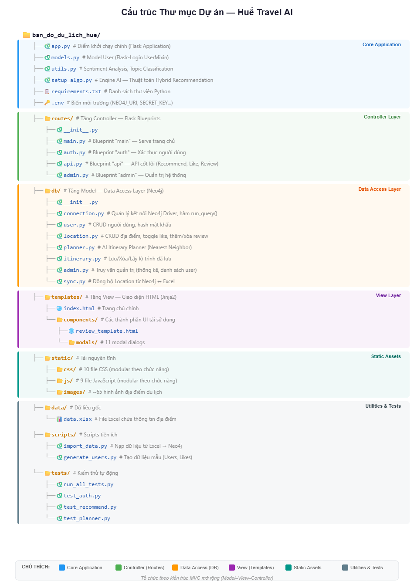

# CHƯƠNG 3: XÂY DỰNG ỨNG DỤNG WEB VÀ TÍCH HỢP HỆ KHUYẾN NGHỊ

Chương này trình bày chi tiết quá trình triển khai hệ thống Huế Travel AI dựa trên bản thiết kế ở Chương 2, bao gồm: môi trường và công nghệ phát triển; cấu trúc tổ chức mã nguồn; triển khai cơ sở dữ liệu đồ thị; triển khai các thuật toán khuyến nghị lai (Hybrid Recommendation); module phân tích cảm xúc (Sentiment Analysis); và triển khai ứng dụng web cùng module AI Planner.

## 3.1. Môi trường và Công nghệ Phát triển

### 3.1.1. Môi trường phần cứng và phần mềm

Hệ thống được xây dựng và thử nghiệm trên môi trường phát triển với cấu hình như sau:

*Bảng 3.1. Môi trường phát triển*

| Thành phần | Chi tiết |
|---|---|
| Hệ điều hành | Windows 11 / Linux (Ubuntu 22.04 LTS) |
| Ngôn ngữ Backend | Python 3.9+ |
| Ngôn ngữ Frontend | JavaScript ES6+, HTML5, CSS3 |
| Cơ sở dữ liệu | Neo4j Community Edition 5.11.2 |
| Thư viện đồ thị | Neo4j Graph Data Science (GDS) 2.24.0 |
| IDE | Visual Studio Code |
| Quản lý mã nguồn | Git & GitHub |

### 3.1.2. Các thư viện và công cụ chính

Hệ thống sử dụng các thư viện mã nguồn mở phổ biến, đảm bảo tính ổn định và khả năng mở rộng.

**a) Thư viện Backend (Python):**

*Bảng 3.2. Các thư viện Python được sử dụng*

| Thư viện | Phiên bản | Vai trò |
|---|---|---|
| Flask | ≥2.0.0 | Micro-framework web, xây dựng RESTful API [17] |
| Neo4j Driver | ≥5.0.0 | Kết nối và thực thi truy vấn Cypher với Neo4j [15] |
| Flask-Login | ≥0.6.0 | Quản lý phiên đăng nhập và xác thực người dùng |
| Werkzeug | ≥2.0.0 | Mã hóa mật khẩu an toàn (PBKDF2-SHA256) |
| Pandas | ≥1.3.0 | Xử lý và phân tích dữ liệu dạng bảng |
| python-dotenv | ≥0.19.0 | Quản lý biến môi trường từ file `.env` |
| openpyxl | ≥3.0.0 | Đọc/ghi file Excel, phục vụ import/export dữ liệu |

**b) Thư viện Frontend (Web):**

*Bảng 3.3. Các thư viện Frontend được sử dụng*

| Thư viện | Vai trò |
|---|---|
| Leaflet.js | Bản đồ tương tác mã nguồn mở [18] |
| Leaflet.markercluster | Gom nhóm markers khi zoom out |
| Leaflet.heat | Tạo bản đồ nhiệt (Heatmap) |
| OpenStreetMap Tile | Lớp ảnh nền bản đồ [19] |

## 3.2. Cấu trúc Tổ chức Mã nguồn

Dự án được tổ chức theo **kiến trúc 3 Tầng (3-Tier Architecture)** kết hợp mô hình MVC, tách biệt rõ ràng giữa tầng trình bày (Presentation Tier), tầng xử lý nghiệp vụ (Business Logic Tier) và tầng dữ liệu (Data Tier). Cấu trúc thư mục tổng quan như sau:

*Hình 3.1. Cấu trúc thư mục dự án*



**Nguyên tắc tổ chức:**

- **Tách biệt trách nhiệm (Separation of Concerns):** Mỗi file/module chỉ đảm nhận một chức năng cụ thể. Ví dụ: `db/user.py` chỉ xử lý CRUD người dùng, `db/planner.py` chỉ chứa logic lập lộ trình.
- **CSS và JS modular:** Mã nguồn frontend được chia thành 10 file CSS và 9 file JS theo chức năng, giúp bảo trì và mở rộng dễ dàng thay vì gộp tất cả vào một file lớn.
- **Template Components:** Giao diện HTML sử dụng Jinja2 `` để tái sử dụng các thành phần modal, tránh lặp code.
- **Data Access Layer:** Tầng `db/` đóng vai trò trung gian duy nhất giữa Flask routes và Neo4j, đảm bảo tất cả truy vấn Cypher đều đi qua một điểm kiểm soát.

## 3.3. Triển khai Cơ sở dữ liệu Đồ thị

Khác với các hệ thống truyền thống sử dụng RDBMS (MySQL, PostgreSQL), đề tài sử dụng Neo4j để mô hình hóa dữ liệu dưới dạng đồ thị, tận dụng lợi thế trong truy vấn quan hệ phức tạp cho bài toán gợi ý (đã phân tích ở mục 1.3.3).

### 3.3.1. Triển khai Lược đồ dữ liệu

Dựa trên thiết kế ở mục 2.4, lược đồ đồ thị được triển khai với 5 loại node và 9 loại relationship (7 relationship cơ bản + 2 relationship SIMILAR_TO và LOC_SIMILAR được tạo bởi thuật toán).

**a) Thuộc tính chi tiết Node `:Location`:**

Ngoài các thuộc tính cơ bản (name, desc, lat, lng, image), node `:Location` còn lưu trữ các thuộc tính phục vụ thuật toán AI — được tạo tự động bởi script `setup_algo.py`:

*Bảng 3.4. Thuộc tính AI của node Location*

| Thuộc tính | Kiểu | Mô tả |
|---|---|---|
| `pagerankScore` | Float | Điểm PageRank thô (từ đồ thị User–Location) |
| `pagerankNorm` | Float | PageRank chuẩn hóa về thang 0–1 |
| `pagerankConnect` | Float | PageRank thô (từ đồ thị Location–Location) |
| `pagerankConnectNorm` | Float | PageRank kết nối chuẩn hóa 0–1 |
| `avgRating` | Float | Điểm đánh giá trung bình |
| `lastAlgoRun` | String | Thời gian chạy thuật toán gần nhất |

**b) Thuộc tính chi tiết Relationship `:INTERACTED`:**

Relationship `:INTERACTED` là quan hệ tổng hợp, được tạo tự động từ `:LIKED` và `:REVIEWED`, phục vụ làm đầu vào cho các thuật toán AI:

*Bảng 3.5. Thuộc tính relationship INTERACTED*

| Thuộc tính | Kiểu | Công thức |
|---|---|---|
| `weight` | Float | `liked_score + review_score` (tối đa = 6.0) |
| `liked_score` | Float | 0 hoặc 1.0 (tùy đã LIKED hay chưa) |
| `review_score` | Float | 0 – 5.0 (bằng số sao đánh giá) |

### 3.3.2. Quy trình nạp và tiền xử lý dữ liệu

Dữ liệu thô từ file Excel (`data/data.xlsx`) được import vào Neo4j thông qua script `scripts/import_data.py`. Sau đó, script `setup_algo.py` thực hiện tiền xử lý qua 2 bước chính:

**Bước 1 — Tạo quan hệ `:INTERACTED`:**

Tổng hợp trọng số tương tác từ `:LIKED` và `:REVIEWED` cho mỗi cặp User–Location:

```cypher
-- Đối với mỗi cặp User-Location:
-- weight = LIKED(0 hoặc 1.0) + REVIEWED(rating 0–5)
-- Tối đa 6 điểm: 1 (Like) + 5 (Review 5 sao)
MERGE (u)-[int:INTERACTED]->(l)
SET int.weight = liked_score + review_score
```

**Bước 2 — Tạo quan hệ `:RELATED_TO`:**

Kết hợp 2 nguồn tín hiệu để xây dựng mạng liên kết giữa các địa điểm:

| Nguồn tín hiệu | Trọng số | Ý nghĩa |
|---|---|---|
| **Co-occurrence** (Đồng xuất hiện) | `common_users × 1.2` | Nếu 3 users cùng thích A và B → weight += 3.6 |
| **Same Category** (Cùng danh mục) | `+0.8` | Nếu A và B cùng "Di tích" → weight += 0.8 |

*Ví dụ:* Đại Nội và Lăng Tự Đức có 3 users chung và cùng danh mục "Di tích lịch sử" → `RELATED_TO.weight = (3 × 1.2) + 0.8 = 4.4`.

## 3.4. Triển khai Thuật toán Khuyến nghị (Recommendation Engine)

Đây là phần cốt lõi của hệ thống, triển khai mô hình **Hybrid Recommendation System** kết hợp 3 phương pháp chính (đã trình bày lý thuyết ở Chương 1). Cần phân biệt rõ: phần này chỉ bao gồm **thuật toán khuyến nghị** (Recommendation Algorithm) — tức logic xếp hạng và gợi ý địa điểm cá nhân hóa. Mô-đun phân tích cảm xúc (Sentiment Analysis) sẽ được trình bày riêng ở mục 3.4.6 vì đó là một module xử lý ngôn ngữ tự nhiên (NLP) độc lập, phục vụ riêng cho chức năng đánh giá.

### 3.4.1. Thuật toán Weighted PageRank

Hệ thống chạy **2 đồ thị PageRank riêng biệt** trên Neo4j GDS, mỗi đồ thị đo lường một khía cạnh khác nhau:

**a) PageRank Phổ biến (`pagerankNorm`):**

Đo mức độ phổ biến của địa điểm dựa trên tương tác người dùng. Chạy trên đồ thị hai phía `User ↔ Location` qua quan hệ `:INTERACTED` (có trọng số).

```cypher
-- Bước 1: Project đồ thị User-Location
CALL gds.graph.project(
    'hybrid_user_graph',
    ['User', 'Location'],
    { INTERACTED: { properties: 'weight' } }
)

-- Bước 2: Chạy Weighted PageRank
CALL gds.pageRank.write('hybrid_user_graph', {
  maxIterations: 12,
  dampingFactor: 0.88,
  relationshipWeightProperty: 'weight',
  writeProperty: 'pagerankScore'
})
```

**b) PageRank Kết nối (`pagerankConnectNorm`):**

Đo độ trung tâm (centrality) của địa điểm dựa trên cấu trúc liên kết giữa các địa điểm. Chạy trên đồ thị `Location ↔ Location` qua `:RELATED_TO` (undirected).

```cypher
-- Bước 1: Project đồ thị Location-Location
CALL gds.graph.project(
    'hybrid_loc_graph',
    'Location',
    { RELATED_TO: { orientation: 'UNDIRECTED', properties: 'weight' } }
)

-- Bước 2: Chạy PageRank Connectivity
CALL gds.pageRank.write('hybrid_loc_graph', {
  maxIterations: 12,
  dampingFactor: 0.88,
  relationshipWeightProperty: 'weight',
  writeProperty: 'pagerankConnect'
})
```

**c) Tham số được sử dụng:**

*Bảng 3.6. Tham số PageRank trong triển khai*

| Tham số | Giá trị | Lý do lựa chọn |
|---|---|---|
| `maxIterations` | 12 | Đủ cho đồ thị nhỏ (~100 nodes) hội tụ |
| `dampingFactor` | 0.88 | Cân bằng giữa tín hiệu toàn cục và cục bộ; cao hơn mặc định (0.85) vì đồ thị nhỏ cần ưu tiên cục bộ hơn |
| `relationshipWeightProperty` | `'weight'` | Sử dụng trọng số tương tác thay vì đếm đơn thuần |

**d) Chuẩn hóa kết quả:**

Sau khi chạy PageRank, hệ thống chuẩn hóa (Normalize) kết quả về thang 0–1 để đảm bảo tính so sánh được:

```
pagerankNorm = pagerankScore / max(pagerankScore)
pagerankConnectNorm = pagerankConnect / max(pagerankConnect)
```

### 3.4.2. Thuật toán Collaborative Filtering

Sử dụng thuật toán **Node Similarity** (Jaccard Index) từ thư viện Neo4j GDS (đã trình bày lý thuyết ở mục 1.6.2) để tìm người dùng có sở thích tương đồng.

**a) Triển khai GDS Node Similarity:**

```cypher
-- Bước 1: Project đồ thị User → Location
CALL gds.graph.project(
    'user_similarity_graph',
    ['User', 'Location'],
    { INTERACTED: { orientation: 'NATURAL' } }
)

-- Bước 2: Chạy Node Similarity (Jaccard)
CALL gds.nodeSimilarity.write('user_similarity_graph', {
    writeRelationshipType: 'SIMILAR_TO',
    writeProperty: 'score',
    topK: 10,
    similarityCutoff: 0.1
})
YIELD nodesCompared, relationshipsWritten, similarityDistribution
```

**b) Tham số thuật toán:**

*Bảng 3.7. Tham số Collaborative Filtering (User Similarity)*

| Tham số | Giá trị | Ý nghĩa |
|---|---|---|
| `writeRelationshipType` | `'SIMILAR_TO'` | Tên quan hệ tạo giữa các cặp User tương đồng |
| `writeProperty` | `'score'` | Thuộc tính lưu điểm Jaccard (0.0–1.0) |
| `topK` | 10 | Mỗi user chỉ giữ tối đa 10 users tương đồng nhất |
| `similarityCutoff` | 0.1 | Ngưỡng tối thiểu — Jaccard < 10% sẽ bị loại |

**c) Sử dụng trong truy vấn gợi ý:**

Kết quả tạo ra relationship `(:User)-[:SIMILAR_TO {score}]-(:User)`. Khi gợi ý cho user A, hệ thống duyệt đồ thị: tìm users tương đồng → lấy địa điểm họ đã thích mà A chưa đi → tính điểm dựa trên số lượng users tương đồng và trung bình trọng số.

### 3.4.3. Thuật toán Content-Based Filtering

Gợi ý địa điểm có cùng danh mục với những nơi người dùng đã thích, bổ trợ cho Collaborative Filtering khi địa điểm mới chưa có đủ tương tác.

**a) Triển khai GDS Node Similarity cho Location:**

```cypher
-- Bước 1: Project đồ thị Location ← User (đảo hướng)
CALL gds.graph.project(
    'loc_similarity_graph',
    ['Location', 'User'],
    { INTERACTED: { orientation: 'REVERSE' } }
)

-- Bước 2: Chạy Node Similarity cho Locations
CALL gds.nodeSimilarity.write('loc_similarity_graph', {
    writeRelationshipType: 'LOC_SIMILAR',
    writeProperty: 'score',
    topK: 5,
    similarityCutoff: 0.15
})
```

**b) Tham số thuật toán:**

*Bảng 3.8. Tham số Content-Based Filtering (Location Similarity)*

| Tham số | Giá trị | Ý nghĩa |
|---|---|---|
| `writeRelationshipType` | `'LOC_SIMILAR'` | Quan hệ tạo giữa các Location tương đồng |
| `topK` | 5 | Mỗi địa điểm chỉ giữ 5 địa điểm tương đồng nhất |
| `similarityCutoff` | 0.15 | Ngưỡng cao hơn User Similarity (15% > 10%) do cần chính xác hơn |
| `orientation` | `'REVERSE'` | Đảo hướng INTERACTED để nhìn từ Location về User |

**c) So sánh 2 thuật toán:**

*Bảng 3.9. So sánh Collaborative Filtering và Content-Based Filtering*

| Tiêu chí | Collaborative Filtering | Content-Based Filtering |
|---|---|---|
| Đối tượng so sánh | User ↔ User | Location ↔ Location |
| Dựa trên | Tập địa điểm đã tương tác | Tập users đã tương tác + Category |
| Relationship tạo ra | `SIMILAR_TO` (User) | `LOC_SIMILAR` (Location) |
| topK | 10 | 5 |
| similarityCutoff | 0.1 (10%) | 0.15 (15%) |
| Câu hỏi giải quyết | "Người giống bạn thích gì?" | "Nơi giống nơi bạn thích?" |

### 3.4.4. Mô hình Gợi ý Lai và Chiến lược Trọng số (Adaptive Hybrid)

Đây là phần tích hợp trung tâm, kết hợp kết quả từ 3 thuật toán trên thành một pipeline thống nhất.

**a) Pipeline xử lý 4 bước:**

*Bảng 3.10. Pipeline Hybrid Recommendation*

| Bước | Thành phần | Nguồn gợi ý | Trọng số |
|---|---|---|---|
| Bước 1 | Collaborative Filtering | Từ users tương đồng (SIMILAR_TO) | ×3 |
| Bước 2 | Content-Based Filtering | Từ category đã thích | ×1 |
| Bước 2.5 | PageRank Diversity Pool | Top 20 địa điểm phổ biến nhất | ×10 |
| Bước 3 | Gộp tất cả | `collab + content + pagerank` | — |
| Bước 4 | Tính Final Score | Sắp xếp, trả về Top 12 | — |

**b) Bước 2.5 — PageRank Diversity Pool:**

Đây là cải tiến quan trọng giải quyết vấn đề **Filter Bubble** (đã trình bày lý thuyết ở mục 1.2.3). Khi người dùng chỉ thích 1 loại danh mục (ví dụ: "Mua sắm"), Content-Based chỉ trả về địa điểm cùng loại → kết quả bị hẹp. Bằng cách luôn bổ sung Top 20 địa điểm có PageRank cao nhất (không phân biệt danh mục), hệ thống đảm bảo sự đa dạng trong kết quả gợi ý.

**c) Công thức tính điểm tổng hợp (Final Score):**

Đối với mỗi địa điểm ứng viên, điểm tổng hợp được tính theo công thức:

$$FinalScore = (P \times w_P) + (C \times w_C) + (R \times w_R)$$

Trong đó:

*Bảng 3.11. Chiến lược trọng số Adaptive Hybrid*

| Thành phần (X) | Trọng số (w) | Chiến lược |
|---|---|---|
| **Độ Phổ biến (P)** — `pagerankNorm` | **0.6 (60%)** | Ưu tiên địa điểm được cộng đồng kiểm chứng (Crowd Wisdom). Đây là tín hiệu đáng tin cậy nhất khi chưa hiểu rõ sở thích user. |
| **Độ Kết nối (C)** — `pagerankConnectNorm` | **0.3 (30%)** | Tận dụng cấu trúc đồ thị. Các địa điểm "trung tâm" (hubs) thuận tiện cho di chuyển giữa các cụm tham quan. |
| **Chất lượng (R)** — `avgRating` | **0.1 (10%)** | Vai trò bổ trợ. Tránh để một vài đánh giá 5 sao ngẫu nhiên làm lệch bảng xếp hạng khi dữ liệu còn thưa. |

**Cơ sở lựa chọn trọng số:**

Chiến lược trọng số 60-30-10 được thiết kế dựa trên đặc thù **dữ liệu thưa (Sparse Data)** của hệ thống thử nghiệm (25 người dùng, 52 địa điểm):

- **PageRank chiếm 60%** vì đây là thành phần duy nhất hoạt động ổn định trong mọi trường hợp, kể cả Cold Start. Khác với việc chỉ đếm số lượt Like đơn thuần, PageRank đánh giá cả *chất lượng* của nguồn tương tác — người dùng đã tương tác với nhiều địa điểm sẽ có "tiếng nói" có trọng lượng hơn, phản ánh đúng nguyên lý Trí tuệ đám đông (Crowd Wisdom) [8].

- **Connectivity chiếm 30%** nhằm tận dụng lợi thế riêng của Graph Database mà các hệ thống dùng RDBMS truyền thống không có. Thành phần này giúp ưu tiên các địa điểm nằm ở vị trí "hub" trung tâm trong mạng lưới du lịch Huế — thuận tiện cho di chuyển giữa các cụm tham quan. Tuy nhiên, nó không được vượt quá PageRank vì bản thân Connectivity không phản ánh sở thích cá nhân.

- **Rating chỉ chiếm 10%** là quyết định có chủ đích. Với quy mô 25 người dùng, nhiều địa điểm chỉ nhận được 1–2 đánh giá — chưa đủ mẫu thống kê (sample size) để đảm bảo tính đại diện. Nếu cho trọng số cao hơn (ví dụ 30–40%), chỉ cần 1 đánh giá 5 sao ngẫu nhiên cũng có thể đẩy một địa điểm ít người biết lên vị trí top, gây méo kết quả gợi ý. Với mức 10%, Rating đóng vai trò "tie-breaker" — chỉ tạo sự khác biệt khi hai địa điểm có PageRank và Connectivity tương đương nhau.

**d) Chiến lược Cold Start (Khởi động lạnh):**

Đối với người dùng mới chưa có tương tác (chưa LIKED hoặc INTERACTED), hệ thống bỏ qua Collaborative và Content-Based Filtering, thay vào đó sử dụng **Fallback Query** chỉ dựa trên điểm PageRank tổng hợp (công thức 60-30-10) để đảm bảo mọi người dùng đều nhận được gợi ý ngay từ lần truy cập đầu tiên.

### 3.4.5. Explainable AI (Giải thích kết quả gợi ý)

Mỗi địa điểm trong danh sách gợi ý đều kèm theo thông tin giải thích chi tiết, giúp người dùng hiểu *tại sao* hệ thống chọn nơi đó — tăng tính minh bạch và độ tin cậy của hệ thống.

*Bảng 3.12. Các thành phần Explainable AI*

| Trường dữ liệu | Mô tả | Ví dụ |
|---|---|---|
| `reason` | Lý do chính bằng ngôn ngữ tự nhiên | "3 người có sở thích giống bạn đã thích địa điểm này" |
| `reason_icon` | Emoji trực quan tương ứng | 👥 Collab, 🎯 Content, 🔥 PageRank |
| `reason_type` | Phân loại lý do | `collab`, `content`, `pagerank`, `default` |
| `reason_details` | Dữ liệu chi tiết cho biểu đồ UI | Điểm và % đóng góp từng thành phần, danh sách users tương đồng, biểu đồ tròn |

### 3.4.6. Module Phân tích Cảm xúc (Sentiment Analysis)

Khác với thuật toán khuyến nghị ở các mục 3.4.1–3.4.4 (chịu trách nhiệm xếp hạng và gợi ý địa điểm), module **Phân tích Cảm xúc** là một thành phần xử lý ngôn ngữ tự nhiên (NLP) độc lập, được triển khai trong file `utils.py`. Module này phục vụ riêng cho chức năng đánh giá (Review), không tham gia vào pipeline tính điểm khuyến nghị.

**Vai trò và phạm vi:**

- **`analyze_sentiment(comment)`:** Phân tích cảm xúc bình luận (tích cực / tiêu cực / trung lập) dựa trên từ điển từ khóa tiếng Việt. Kết quả được lưu vào thuộc tính `sentiment` của relationship `:REVIEWED` để hiển thị nhãn cảm xúc trên giao diện.
- **`classify_comment_topic(comment)`:** Phân loại chủ đề bình luận (phong cảnh, dịch vụ, giá cả, ẩm thực...) dựa trên keyword matching.

**Lưu ý quan trọng:** Module này sử dụng phương pháp keyword-based đơn giản, không áp dụng mô hình học máy. Kết quả sentiment chỉ phục vụ việc hiển thị trực quan cho người dùng, không được sử dụng làm đầu vào cho thuật toán khuyến nghị Hybrid.

## 3.5. Triển khai Ứng dụng Web

### 3.5.1. Kiến trúc Backend (Flask Blueprints)

Mã nguồn backend được tổ chức theo kiến trúc modular, chia thành 4 Blueprint:

*Bảng 3.13. Các Flask Blueprints*

| Blueprint | File | Chức năng |
|---|---|---|
| `main` | `routes/main.py` | Serve trang chủ (`index.html`) — điểm vào chính |
| `auth` | `routes/auth.py` | Đăng ký, đăng nhập, đăng xuất, quên mật khẩu, hồ sơ |
| `api` | `routes/api.py` | API cốt lõi: Gợi ý AI, Like, Review, Lộ trình, Similar |
| `admin` | `routes/admin.py` | CRUD địa điểm, quản lý user, chạy lại thuật toán AI |

**Tầng truy cập dữ liệu (Data Access Layer — `db/`):**

Hệ thống tách biệt logic truy vấn cơ sở dữ liệu vào thư mục `db/` với các module chuyên biệt:

*Bảng 3.14. Các module Data Access Layer*

| Module | Chức năng |
|---|---|
| `db/connection.py` | Quản lý kết nối Neo4j (driver, hàm `run_query` helper) |
| `db/user.py` | Đăng ký, xác thực, hash mật khẩu (Werkzeug) |
| `db/location.py` | CRUD địa điểm, truy vấn lọc/tìm kiếm |
| `db/planner.py` | AI Itinerary Planner (Nearest Neighbor + Weighted Selection) |
| `db/itinerary.py` | Lưu/Xóa/Lấy lộ trình đã lưu |
| `db/admin.py` | Truy vấn quản trị (thống kê, danh sách user) |
| `db/sync.py` | Đồng bộ dữ liệu Location từ Neo4j ↔ Excel |

**Module Phân tích Cảm xúc (`utils.py`) — *độc lập với thuật toán khuyến nghị*:**

File `utils.py` chứa module Sentiment Analysis, là thành phần NLP riêng biệt phục vụ chức năng đánh giá — không thuộc pipeline thuật toán khuyến nghị (xem mục 3.4.6):

- **`analyze_sentiment(comment)`:** Phân tích cảm xúc bình luận (tích cực / tiêu cực / trung lập) dựa trên từ điển từ khóa tiếng Việt.
- **`classify_comment_topic(comment)`:** Phân loại chủ đề bình luận (phong cảnh, dịch vụ, giá cả, ẩm thực...) dựa trên keyword matching.

### 3.5.2. Giao diện Frontend

Giao diện được xây dựng bằng HTML5, CSS3 và JavaScript thuần (Vanilla JS), tổ chức modular theo chức năng.

**a) Cấu trúc JavaScript (`static/js/`):**

*Bảng 3.15. Các module JavaScript*

| File | Chức năng |
|---|---|
| `app.js` | Khởi tạo ứng dụng, quản lý state chung |
| `map.js` | Bản đồ Leaflet, markers, popup, sidebar chi tiết |
| `auth.js` | Đăng nhập, đăng ký, quên mật khẩu |
| `recommend.js` | Hiển thị gợi ý AI, biểu đồ phân tích |
| `planner.js` | AI Planner UI, lưu/xem/xóa lộ trình |
| `reviews.js` | Đánh giá, lọc theo sao, hiển thị cảm xúc |
| `profile.js` | Trang hồ sơ người dùng |
| `admin.js` | Dashboard quản trị |
| `utils.js` | Hàm tiện ích dùng chung (notification, sanitize...) |

**b) Các thành phần giao diện chính:**

- **Bản đồ chính:** Sử dụng `L.map` với tile layer từ OpenStreetMap, hiển thị toàn cảnh thành phố Huế với zoom level phù hợp.
- **Thanh bên (Sidebar):** Hiển thị danh sách địa điểm, hỗ trợ lọc theo danh mục và tìm kiếm nhanh.
- **Hiển thị điểm AI:** Sử dụng thanh tiến trình (Progress Bar) để trực quan hóa điểm chất lượng tổng hợp theo tỷ lệ 60-30-10, giúp người dùng dễ so sánh.
- **Bản đồ nhiệt (Heatmap):** Overlay trên bản đồ chính, hiển thị mật độ phổ biến dựa trên dữ liệu PageRank.

### 3.5.3. Tiện ích bổ trợ lập lộ trình

Để gia tăng tính hữu dụng cho ứng dụng web, hệ thống được bổ sung một module tiện ích nhỏ phục vụ việc xắp xếp lịch trình. Tính năng này đóng vai trò như một bộ lọc sắp xếp lại danh sách các địa điểm đã được thuật toán AI gợi ý (hoặc theo danh sách đã thích của người dùng) từ trước. 

Thay vì phát triển một engine thuật toán phức tạp như bài toán tối ưu lộ trình chuyên sâu định tuyến đa phương tiện, hệ thống được tinh gọn bằng việc áp dụng nguyên tắc khoảng cách gần nhất (Greedy) bằng công thức tính khoảng cách điểm Euclid cơ bản. Các địa điểm được phân bổ tuần tự theo các buổi trong ngày. Cách thiết kế này vừa giảm thiểu thời gian tính toán ở backend vừa đủ để tạo được một lộ trình tham khảo hợp lý, đóng góp vào việc kiểm chứng khả năng ứng dụng thực tế của kết quả gợi ý.

## 3.6. Demo Website

Phần này trình bày giao diện thực tế của hệ thống Huế Travel AI sau khi triển khai, minh họa các chức năng chính thông qua ảnh chụp màn hình.

### 3.6.1. Trang chủ — Bản đồ tương tác

Giao diện trang chủ hiển thị bản đồ Leaflet.js toàn màn hình với sidebar bên trái chứa danh sách địa điểm, bộ lọc theo danh mục và thanh tìm kiếm. Các marker được phân loại theo icon tương ứng với category.

*Hình 3.2. Giao diện trang chủ — Bản đồ tương tác*


### 3.6.2. Đăng ký và Đăng nhập

Hệ thống cung cấp modal đăng ký/đăng nhập với giao diện Dark Mode, hỗ trợ validation realtime (kiểm tra độ dài username, password).

*Hình 3.3. Giao diện đăng ký tài khoản*


*Hình 3.4. Giao diện đăng nhập*


### 3.6.3. Chi tiết địa điểm

Khi click vào một marker hoặc card địa điểm, hệ thống hiển thị thông tin chi tiết bao gồm: tên, mô tả, hình ảnh, điểm chất lượng AI (thanh Progress Bar 60-30-10), danh sách đánh giá kèm nhãn cảm xúc (Sentiment), và các địa điểm tương tự.

*Hình 3.5. Giao diện chi tiết địa điểm*


### 3.6.4. Đánh giá và Phân tích cảm xúc

Người dùng đã đăng nhập có thể chấm điểm (1–5 sao) và viết bình luận. Hệ thống tự động phân tích cảm xúc (Positive/Negative/Neutral) và phân loại chủ đề (Món ăn, Không gian, Phục vụ...).

*Hình 3.6. Giao diện viết đánh giá và kết quả phân tích cảm xúc*


### 3.6.5. Gợi ý AI (Hybrid Recommendation)

Tab "Gợi ý AI" trên sidebar hiển thị Top 12 địa điểm được gợi ý cá nhân hóa, mỗi card kèm theo lý do gợi ý (Explainable AI), biểu đồ phân tích thành phần điểm (Collaborative, Content-Based, PageRank) và danh sách users tương đồng.

*Hình 3.7. Giao diện gợi ý AI với Explainable AI*


*Hình 3.8. Biểu đồ phân tích thành phần điểm gợi ý*


### 3.6.6. Lập lộ trình thông minh

Modal AI Planner cho phép người dùng chọn số ngày (1–5), sở thích (danh mục) và chế độ (AI gợi ý / từ danh sách đã thích). Kết quả hiển thị dạng timeline với thời gian và khoảng cách giữa các điểm.

*Hình 3.9. Giao diện modal lập lộ trình*


*Hình 3.10. Kết quả lộ trình dạng timeline*


### 3.6.7. Lịch sử hoạt động

Trang lịch sử hiển thị 3 tab: Địa điểm đã thích, Đánh giá đã viết và Lộ trình đã lưu, giúp người dùng theo dõi hoạt động cá nhân.

*Hình 3.11. Giao diện lịch sử hoạt động*


### 3.6.8. Trang quản trị (Admin Dashboard)

Admin Dashboard cung cấp giao diện quản lý toàn diện: thống kê hệ thống, danh sách người dùng, CRUD địa điểm và nút trigger chạy lại thuật toán AI.

*Hình 3.12. Giao diện Dashboard quản trị*


*Hình 3.13. Giao diện quản lý địa điểm (Thêm/Sửa/Xóa)*


## 3.7. Tiểu kết chương 3

Chương này đã trình bày chi tiết quá trình triển khai hệ thống Huế Travel AI, từ thiết kế đến hiện thực hóa. Cụ thể:

1. **Môi trường phát triển:** Sử dụng Python 3.9+, Flask, Neo4j 5.11 với GDS 2.24, JavaScript ES6+ và Leaflet.js.

2. **Cấu trúc mã nguồn:** Tổ chức theo kiến trúc MVC mở rộng với nguyên tắc tách biệt trách nhiệm — 4 Blueprint (Controller), 7 module Data Access (Model), CSS/JS modular (View).

3. **Cơ sở dữ liệu đồ thị:** Triển khai lược đồ 5 node, 9 relationship trên Neo4j với quy trình tiền xử lý tự động (INTERACTED, RELATED_TO, SIMILAR_TO, LOC_SIMILAR).

4. **Thuật toán khuyến nghị lai (Recommendation Engine):** Triển khai thành công pipeline 4 bước kết hợp Weighted PageRank (dampingFactor=0.88), Collaborative Filtering (Jaccard, topK=10), Content-Based Filtering (topK=5), PageRank Diversity Pool (Top 20) và chiến lược trọng số thích ứng 60-30-10.

5. **Explainable AI:** Mỗi gợi ý kèm lý do bằng ngôn ngữ tự nhiên, biểu đồ phân tích và dữ liệu chi tiết.

6. **Module Phân tích Cảm xúc (Sentiment Analysis):** Triển khai riêng biệt với thuật toán khuyến nghị, phục vụ chức năng đánh giá — phân tích cảm xúc và phân loại chủ đề bình luận bằng phương pháp keyword-based.

7. **Ứng dụng web:** Backend Flask modular (4 Blueprint, 7 module DAL), Frontend Vanilla JS (9 module), tích hợp Leaflet.js cho bản đồ tương tác.

8. **Tiện ích xếp lộ trình:** Tích hợp tính năng phụ trợ giúp sắp xếp thứ tự tham quan theo ngày dựa trên nguyên tắc gần nhất nhằm hoàn thiện giao diện phục vụ thực nghiệm người dùng.

9. **Demo website:** Minh họa giao diện thực tế qua 12 ảnh chụp màn hình, bao gồm: trang chủ bản đồ, đăng ký/đăng nhập, chi tiết địa điểm, đánh giá + sentiment, gợi ý AI + Explainable AI, lập lộ trình, lịch sử hoạt động và trang quản trị.
